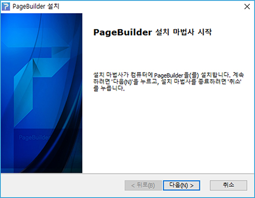
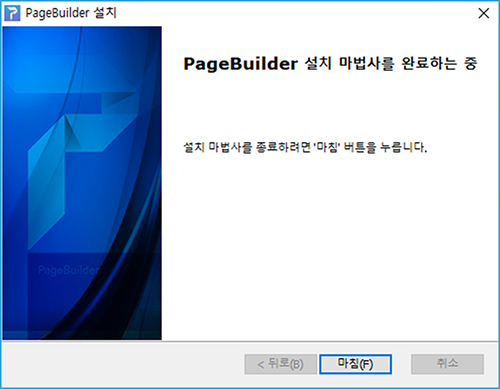
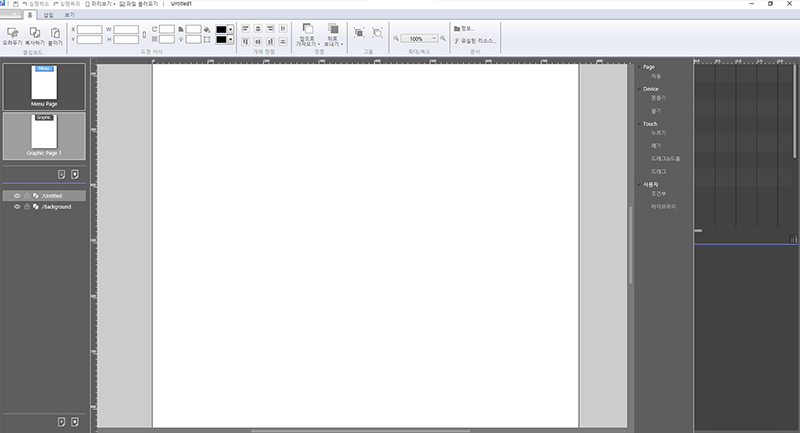

# PageBuilder 설치하기

> ## 페이지빌더 설치 환경

* Operating System: Window7 이상
* Memory: 최소4G, 권장 8G 이상
* Framework: Microsoft .Net Framework 4.6.1 이상
* Library: Microsoft Visual C++ 2013 Redistributable

## 페이지빌더 다운로드

1. 페이지빌 실행 파일을 다운로드합니다.
2. PageBuilder.exe 실행 파일을 실행합니다. 
3. 설치 시작 화면에서 다음\(N\)&gt;을 클릭합니다. 
4. 설치될 폴더를 지정한 후 다음\(I\)&gt;을 클릭합니다.  
5. 다음 화면에서 설치\(N\)&gt;을 클릭합니다.  
6. 마침\(F\)&gt;을 클릭합니다.  

## 페이지빌더 실행

1. 시작 메뉴를 클릭하여 앞에서 설치한 페이지빌더 바로가기를 클릭해서 실행합니다.  
2. 프로그램이 실행되면서 페이지빌 로딩 페이지가 나타납니다.  
3. 실행된 로그인 화면에서 사용자 ID와 비밀번호를 입력한 후 로그인을 클릭하면 페이지빌가 실행됩니다.  

4. 실행 후 작업창이 표시됩니다.

