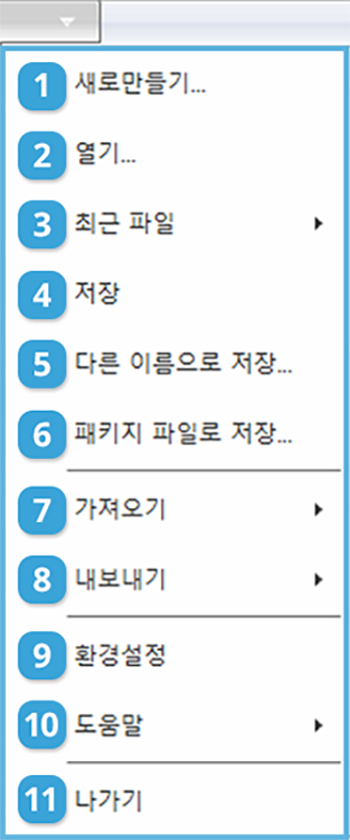
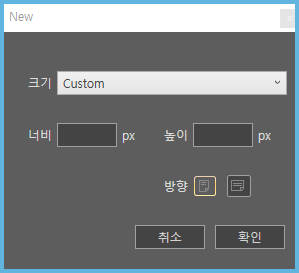

# 파일 메뉴 설명

## 파일 메뉴

페이지 빌더의 유일한 메뉴는 파일 메뉴입니다. 파일 메뉴에는 새로만들기, 열기, 저장, 내보내기 등의 기능이 있습니다. 이 절에서는 파일 메뉴의 순서대로 기능을 설명합니다.

화면 상단의 파일 메뉴를 클릭하면 다음과 같은 메뉴 목록이 나타납니다.

## **① 새로만들기**

새로 만들기는 새로 작업을 시작합니다. 다음 대화상자에서 작업영역의 크기와 방향을 지정할 수 있습니다. 설정 완료 후 확인을 누르면 새창이 뜹니다. 

## **② 열기**

기존에 저장된 페이지빌더 파일\(확장자.pb\)을 열 수 있습니다.

## **③ 최근 파일**

최근에 작업한 파일의 목록을 볼 수 있습니다.

## **④~⑤ 저장 / 다른 이름으로 저장**

작업한 내용을 파일로 저장합니다. 페이지 빌더는 내부에서 효과적인 작업을 위해 자체적인 파일 포맷을 사용합니다. 문서의 내용뿐만 아니라 문서 정보, 레이어와 같은 편집 정보를 저장합니다. 파일 확장자는 .pb입니다.

## **⑥ 패키지 파일로 저장**

저장 위치와 폴더 이름을 설정한 후 저장을 누르면 \_pkg.pb와 작업에 사용한 모든 리소스가 \[파일명\]\_Package 폴더에 저장됩니다. 동시에 zip 파일이 같이 생성됩니다.

## **⑦ 가져오기**

가져오기 메뉴에서 pdf 파일을 불러올 수 있습니다. 가져온 페이지는 페이지빌더의 개별 페이지에 배치됩니다. \(이미지 형태로 가져오므로 pdf 객체의 편집은 불가능합니다.\)

> pdf 파일을 불러올 경우 작업하고 있는 페이지의 다음 페이지에 불러온 pdf 파일의 이미지가 나타납니다.

## **⑧ 내보내기**

내보내기 기능에는 \[썸네일 내보내기\]와 \[HTML5 내보내기\]가 있습니다.

#### \[썸네일 내보내기\]

\[썸네일 내보내기\]를 사용하면 작업한 페이지가 png파일로 내보내집니다. 전체 페이지 혹은 부분 페이지를 내보낼 수 있습니다. 또한 내보낼 이미지의 크기를 조절할 수 있으며, 비율을 변경하면 이미지 크기에 영향을 줍니다.

#### \[HTML5 내보내기\]

\[HTML5 내보내기\]에서는 작업한 문서가 \[파일명\] 폴더가 내보내집니다. 동시에 zip 파일도 생성됩니다.

> html 제목 부분에 작성한 내용은 내보내지는 html의 파일명이 아닌 웹 브라우저 \(브라우저 탭\)에 나타나는 페이지 타이틀 입니다.

내보낸 후 파일명/pb.html을 더블클릭하면 웹 브라우저에서 바로 실행이 됩니다.

## **⑨ 환경설정**

**환경설정에는 \[작업 환경\]과 \[문서 정보\] 탭이 있습니다.**

#### \[작업 환경\]탭 에서는 스냅 영역, 픽셀 이동, 안내선의 위치와 색상을 설정할 수 있습니다.

**\[스냅 영역\]** 은 컨트롤 패널의 \[보기\]-\[안내선에 붙이기\], \[박스선에 붙이기\] 사용시에 객체가 안내선 또는 도형에 붙는 거리를 수치로 조절할 수 있습니다.

**\[픽셀 이동\]** 은 Shift+방향기로 객체의 위치를 조정할 시에 한번씩 이동할 px 거리를 조절할 수 있습니다. 

**\[안내선의 위치\]** 로 필요시에 따라 안내선을 레이어 최상단이나 최하단에 위치하도록 설정할 수 있습니다.

**\[안내선 색상\]** 에선 박스 표시선과 안내선의 색상을 자유롭게 바꿀 수 있습니다..

#### \[문서 정보 탭\]에서는 문서의 정보를 설정합니다. 파일명이 비어있을 경우 html 파일명은 페이지 번호순으로 생성됩니다.

## **⑩도움말**

도움말에는 \[Pagebuilder에 대해\]와 \[\(주\)클비시스템\]가 있습니다.

\[Pagebuilder에 대해\]에서는 페이지빌더의 버전 정보를 확인할 수 있습니다.

\[\(주\)클비시스템\]을 선택시엔 회사의 정보를 볼 수 있는 클비시스템의 홈페이지와 연결됩니다.

## **⑪나가기**

현재 작업 중인 문서를 닫고 페이지빌더를 종료합니다.

