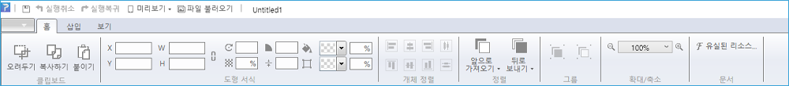
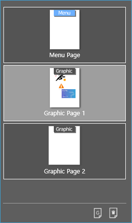
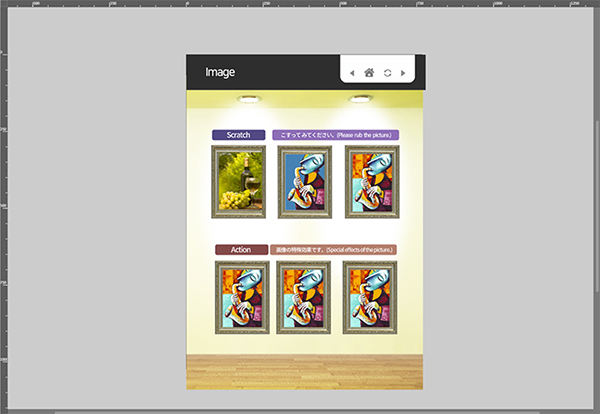
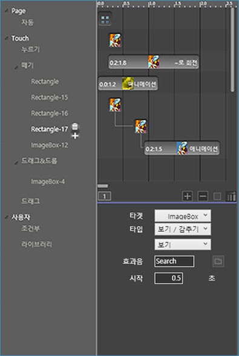

# 작업 영역 살펴보기

## 페이지빌더 작업 영역

페이지빌더는 6개의 주요 작업 영역으로 구성됩니다. 화면 구성이 직관적이고 간단하므로 초보 사용자도 쉽게 사용할 수 있습니다. 숙련된 사용자는 고급 기능을 사용하여 더 빠른 편집을 할 수 있습니다.

### **① 빠른 실행 도구 모음**

빠른 실행 도구 모음은 화면 최상단에 위치합니다. 빠른 실행 도구 모음에는 \[저장\], \[실행취소\], \[실행복귀\], \[미리보기\], \[파일 불러오기\] 같은 사용자가 자주 사용하는 도구가 있습니다.

### **② 컨트롤 패널**

컨트롤 패널은 화면 상단에 위치합니다. 컨트롤 패널에는 객체를 세부적으로 편집할 때 사용하는 기능들을 담고 있습니다. 예를 들어, 객체의 크기와 위치를 조절하는 기능과 색상을 변경하는 속성이 있습니다.

### **③ 페이지 패널**

페이지 패널에서는 페이지 윤곽이 보이는 썸네일 이미지의 목록을 볼 수 있습니다. 드래그로 페이지 순서를 재배치할 수 있으며, 페이지를 추가하거나 삭제할 수 있습니다.

### **④ 레이어 패널**

레이어 패널에서는 레이어를 편리하게 구성하고 관리할 수 있습니다. 페이지별 레이어 목록 확인과 레이어 추가, 삭제를 할 수 있습니다. 또한, 앞의 눈 아이콘을 클릭하면 작업창에서 레이어를 숨기거나 보이게 할 수 있고, 앞의 자물쇠 아이콘을 누르시면 레이어 이동을 잠그거나 풀 수 있습니다.

> 레이어 패널에서 객체 잠금시에는 작업창 위의 객체는 선택되지 않아 움직일 수 없습니다. 하지만 레이어 패널에서의 잠금된 레이어는 선택이 가능하여 레이어의 순서 변경과 객체 순서를 바꿀 수 있습니다.

### **⑤ 작업창**

작업창은 화면 중앙에 위치하며 사용자가 편집하는 영역입니다. 작업 영역에 그려진 객체들은 최종 출력에서도 보입니다. 예를 들면 작업 영역 밖에서부터 작업 영역 안쪽으로 이동하는 객체 애니메이션은 이 영역에서만 보입니다. 그리드와 가이드라인을 적절하게 사용하면 편집에 도움을 받을 수 있습니다.

### **⑥ 액션 패널**

액션 패널은 객체에 동작 효과 또는 사용자 인터랙션을 줄 수 있는 작업 영역입니다. 예를 들어 객체를 시간별로 이동하거나 회전하기, 깜박거리는 효과가 있습니다. 액션이 적용된 객체는 타임라인에서 볼 수 있습니다. 

왼쪽의 액션 컨트롤러에서 액션을 실행시키는 다양한 모드들이 있습니다. 모드 선택 후 옆 추가 버튼을 누르면 액션 타켓을 설정할 수 있는 팝업창이 뜹니. 오른쪽 상단의 타임라인 상태표시에서는 시간의 흐름에 따른 액션이 표시됩니다. 액션을 편집하거나 적용 시간을 수정할 수 있습니다. 오른쪽 하단의 액션 속성 창에서 객체에 적용된 액션의 세부 속성값을 조절할 수 있습니다.

