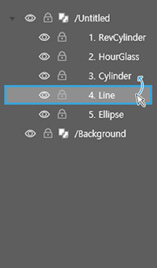
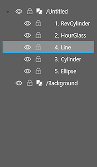

# 컨트롤 패널 살펴보기

## 컨트롤 패널

컨트롤 패널은 최상단의 탭\(홈, 삽입, 보기\)에 따라 다른 형태의 리본 메뉴가 나타납니다. 또한 객체의 유형\(텍스트박스, 이미지박스, 무비박스 등\)에 따라 속성값을 지정할 수 있 서식 메뉴가 나타납니다.

* 홈 탭 에서는 객체를 편집하는 도구들을 보여줍니다. 
* 삽입 탭에서는 텍스트 박스, 이미지 박스, 도형 등 다양한 도구들을 보여줍니다. 
* 보기 탭에서는 작업에 도움이 되는 눈금자, 안내선을 보여줍니다.

## **홈 탭**

컨트롤 패널의 기본은 홈 탭 모드입니다. \[홈 탭\]에는 ①클립보드, ②도형 서식, ③개체 정렬, ⑥정렬, ⑤확대/축소, ⑥그룹, ⑦유실된 리소스 같은 객체를 편집하기 위한 편리 기능이 있습니다.

### **① 클립보드**

* 오려두기: 객체를 지웠다가 다시 붙이는 기능입니다.
* 복사하기: 객체를 복사하는 기능입니다.
* 붙이기: 복사한 것을 붙이는 기능입니다.

### **② 도형**

* X, Y: 객체의 위치를 나타내며 임의로 지정할 수 있습니다. \(단위는 px\)
* W, H: 객체의 크기\(너비와 높이\)를 나타내며 임의로 지정할 수 있습니다. \(단위는 px\)
* \(1\) 회전: 객체에 회전 값을 나타냅니다. \(단위는 radian\)
* \(2\) 불투명도: 객체의 불투명도를 나타냅니다.
* \(3\) 라운딩 크기: 사각형 가장자리의 둥근 정도를 나타냅니다.
* \(4\) 선 두께: 선의 굵기를 나타냅니다. \(단위는 px\)
* \(5\) 채움 색상: 객체 내부를 원하는 색상으로 채웁니다.
* \(6\) 테두리 색상: 객체 테두리의 색상을 나타냅니다.

### **③ 객체 정렬**

정렬은 여러 개의 레이어 모서리 위치를 맞추거나 간격을 적절하게 지정할 수 있는 도구입니다. 두 개 이상의 레이어를 선택한 후 원하는 방향의 정렬 및 배분 아이콘을 선택하시면 됩니다.

| 왼쪽 정렬 | 가운데\(수직\) 정렬 | 오른쪽 정렬 | 수직 중앙 정렬 |
| :---: | :---: | :---: | :---: |
|  |  |  |  |

| 상단 정렬 | 가운데\(수평\) 정렬 | 하단 정렬 | 수평 중앙 정렬 |
| :---: | :---: | :---: | :---: |
|  |  |  |  |

### **④ 정렬\(z-index\)**

객체를 선택한 후 정렬 아이콘을 선택하시면 객체의 배치 순서를 바꿀 수 있습니다.

| 현재 위치 \(2-3-1\) | 앞으로 가져오기 \(2-1-3\) | 맨 앞으로 가져오기 \(1-2-3\) |
| :---: | :---: | :---: |
|  |  |  |

| 현재 위치 \(1-2-3\) | 뒤로 보내기 \(2-1-3\) | 맨 뒤로 보내기 \(2-3-1\) |
| :---: | :---: | :---: |
|  |  |  |

객체의 정렬 순서\(z-index\)는 레이어 패널에서 확인할 수 있으며, 드래그앤드롭으로도 객체 순서를 바꿀 수 있습니다.

| 현재위치 | 앞으로 가져오기 | 맨앞으로 가져오기 |
| :---: | :---: | :---: |
|  |  |  |

###  **⑤ 그**룹

그룹으로 둘 이상의 객체를 묶어 하나의 객체처럼 다룰 수 있습니다.

| 그룹 지정 | 그룹 해제 |
| :---: | :---: |
| ​​ | ​ |

* 그룹 지정: 여러 개의 객체를 선택하고 그룹 아이콘을 클릭하면 그룹화됩니다.
* 그룹 해제: 그룹 해제 아이콘을 클릭하면 그룹이 해제됩니다.

| 그룹 지정 시 레이어 | 그룹 해제 시 레이어 |
| :---: | :---: |
|  |  |

그룹화는 레이어 패널에서 확인할 수 있으며, 드래그앤드롭으로도 그룹 순서를 바꿀 수 있습니다.

### **⑥ 확대/축소**

작업 창의 화면을 원하는 비율에 맞 확대/축소 할 수 있습니다.

### **⑦ 유실된 리소스**

유실된 리소스란 페이지빌더 문서에서 참조하고 있으나 실제 존재하지 않는 리소스\(이미지 파일, 액션\)를 의미합니다.

* \(1\) 파일 대치: 유실된 파일을 다른 파일로 대치합니다.
* \(2\) 폴더 대치: 폴더 전체의 파일들을 같은 이름의 파일로 대치합니다.

\[액션\] 항목에서 유실된 액션 효과를 선택하고 하단의 아이콘을 클릭하면 유실된 액션 경로를 찾을 수 있습니다.

## **삽입 탭**

상단 메뉴에서 삽입 탭을 선택하면 다음 그림과 같이 리본 메뉴가 삽입 탭 모드로 바뀝니다. 텍스트박스, 이미지박스, 스크롤, 웹박스, 무비박스, 테이블를 그릴 수 있습니다. 또한, 다양한 모양의 도형을 그릴 수 있습니다.

### **① 텍스트박스**

텍스트 박스는 글 상자입니다. 텍스트 박스를 선택하면 다음과 같은 텍스트 서식 메뉴가 나타납니다.

서식 메뉴에서 폰트의 종류, 폰트 크기 등의 글자 스타일과 들여쓰기, 행 간격 등 단락 스타일을 지정할 수 있습니다. \[Auto Resizing\]은 작성한 텍스z트 높이에 맞춰 텍스트 박스 사이즈가 자동 조절 됩니다.

### ▣ **텍스트 입력하기**

\(1\) 텍스트 박스 아이콘을 클릭하고 작업 창에 드래그하면 텍스트 박스가 생성됩니다. 

\(2\) 생선된 박스를 더블 클릭하면 텍스트를 입력할 수 있습니다. 텍스트 박스 리본 메뉴의 글꼴과 단락 기능을 주로 사용해 텍스트를 편집합니다.

<table>
  <thead>
    <tr>
      <th style="text-align:left">1 - &#xAE00;&#xAF34;</th>
      <th style="text-align:left">2 - &#xB2E8;&#xB77D;</th>
    </tr>
  </thead>
  <tbody>
    <tr>
      <td style="text-align:left">
        
1-&#x2460; &#xAE00;&#xAF34;

        
1-&#x2461; &#xAE00;&#xAF34; &#xAD75;&#xAE30;

        
1-&#x2462; &#xAE00;&#xAF34; &#xD06C;&#xAE30;

        
1-&#x2463; &#xC790;&#xAC04;

        
1-&#x2464; &#xC0C9;&#xC0C1;

        
1-&#x2465; &#xC7A5;&#xD3C9;

        
1-&#x2466; &#xAE00;&#xAF34; &#xC2A4;&#xD0C0;&#xC77C;

      </td>
      <td style="text-align:left">
        
2-&#x2460; &#xB2E8;&#xB77D; &#xC815;&#xB82C;

        
2-&#x2461; &#xB2E8;&#xB77D; &#xB9DE;&#xCDA4;

        
2-&#x2462; &#xCCAB; &#xC904; &#xC67C;&#xCABD; &#xB4E4;&#xC5EC;&#xC4F0;&#xAE30;

        
2-&#x2463; &#xC67C;&#xCABD; &#xB4E4;&#xC5EC;&#xC4F0;&#xAE30;

        
2-&#x2464; &#xC624;&#xB978;&#xCABD; &#xB4E4;&#xC5EC;&#xC4F0;&#xAE30;

        
2-&#x2465; &#xD589;&#xAC04;

        
2-&#x2466; &#xC717; &#xBB38;&#xB2E8;&#xACFC;&#xC758; &#xAC04;&#xACA9;

        
2-&#x2467; &#xC544;&#xB7AB; &#xBB38;&#xB2E8;&#xACFC;&#xC758; &#xAC04;&#xACA9;

        
2-&#x2468; &#xC0C1;&#xD558;&#xC88C;&#xC6B0; &#xC5EC;&#xBC31;&#xC8FC;&#xAE30;

      </td>
    </tr>
  </tbody>
</table>### ② **이미지 박스**

이미지 박스는 이미지를 넣을 수 있는 박스입니다. 이미지 박스의 객체를 선택하면 이미지 박스의 서식 메뉴가 나타납니다.

서식 메뉴에서 이미지의 크기와 속성을 지정할 수 있습니다. 왼쪽의 옵션 영역의 파일 아이콘을 클릭하면 이미지 파일을 가져올 수 있습니다. 이미지 자르기\(크롭\)과 액션 효과를 적용할 수 있습니다. 

현재 지원하는 이미지 형식은 png, jpeg, jpe, gif, tiff, tif 입니다.

### ▣ **이미지 넣기**

\(1\) 이미지 박스를 클릭하고 작업창에 드래그를 하면 이미지 박스가 생성됩니다. 

 \(2\) 이미지 박스 선택 후 이미지 박스 서식 메뉴에서 왼쪽에 있는 파일 아이콘을 선택하면 이미지가 열립니다.

### ▣ **이미지 자르기**

이미지 박스 서식 메뉴에서 '크롭'을 선택한 후 이미지 포인터를 드래그하여 이미지 크기를 조절할 수 있습니다.

### ▣ **이미지에 액션 효과 적용하기**

**이미지 박스를 선택하고 이미지 리본 메뉴에서 \[옵션\] - \[액션\]을 선택합니다.**

이미지에 다양한 액션 효과를 적용할 수 있습니다.

| 푸쉬 | 토글 | 깜빡거림 |
| :---: | :---: | :---: |
|  |  |  |

| 스크래치 1 | 스크래치 2 | 스크래치 3 |
| :---: | :---: | :---: |
|  |  |  |

* 푸쉬: 이미지를 클릭하면 다음 이미지가 보였다가 사라집니다. 
* 토글: 이미지를 클릭하면 다음 이미지가 나타납니다. 
* 깜빡거림: 첫번째 이미지와 두번째 이미지가 번갈아 나타납니다. 속도와 동작 시간을 조절할 수 있습니다.
* 스크래치1: 첫번째 이미지에서 마우스 드래그한 부분이 지워지면서 두번째 이미지가 나타납니다.
* 스크래치2: 이미지 위에 마우스로 드래그한 부분이 지워집니다. 
* 스크래치3: 마우스로 드래그한 부분에 선택한 색상이 나타납니다. 

### **③ 스크롤**

스크롤 기능으로 화면의 스크롤 영역 크기를 조절할 수 있습니다.

스크롤 화면의 사이즈를 contents width\(가로\)와 contents height\(세로\)의 입력칸에 수치를 입력해서 조절 할 수 있습니다. 또한 스크롤 모양을 선택할 수 있습니다. 

### **④ 웹 박스**

웹 박스를 사용해서 웹 사이트를 작업창에 가져올 수 있습니다.

웹 박스 선택 후 웹 박스 서식 메뉴에서 URL 입력 박스에 웹 주소를 입력하면 됩니다. 

### ▣ **URL 주소 넣기**

\(1\) 웹 박스를 선택한 후 작업창에 드래그를 합니다.

\(2\) 생성된 웹 박스를 더블 클릭 한 후 웹 박스 서식 메뉴에서 URL 입력 박스에 URL 주소를 입력합니다.

\(3\) 미리보기 창에서 입력한 URL의 웹페이지를 볼 수 있습니다.

### **⑤ 무비 박스**

무비 박스 모드에서는 작업창에서 동영상 파일 재생을 할 수 있습니다.

무비 박스 서식 메뉴에서 영상의 크기와 위치를 지정할 수 있습니다. 무비 박스 선택 후 경로의 파일 아이콘을 체크하면 영상 파일을 가져올 수 있습니다. \(현재 지원하는 비디오 형식은 mp4입니다.\)

### ▣ **영상 가져오기**

\(1\) 무비 박스 선택 후 작업 창에 드래그합니다.

\(2\) 객체를 더블 클릭한 후 무비 박스 서식 메뉴 맨 왼쪽에 있는 파일 아이콘을 클릭한 뒤 영상 파일을 선택하면 영상이 나타납니다.

\(3\) 미리보기 창을 열면, 영상을 재생할 수 있습니다. 

> 영상 미리보기는 미리보기 하위 메뉴 중 'Google Chrome'과 'Internet Explorer' 에서만 확인이 가능합니다. \(작업창과 미리보기 하위 메뉴 중 '미리보기' 에서는 영상 재생이 불가합니다.\)

### **⑥ 테이블**

테이블을 이용하여 작업창 표를 만들 수 있습니다.

테이블 서식 메뉴에서 표의 크기와 위치를 지정할 수 있습니다. 테두리 더블 클릭하시면 의 테두리 세부 설정이 가능합니다.

### ▣ **테이블 사용하기**

테이블 아이콘을 클릭하면 표의 칸수를 설정할 수 있는 칸이 나타납니다. 원하시는 만큼의 칸수를 마우스로 선택한 뒤 작업 창에 드래그하면 테이블이 만들어집니다. 만든 테이블 안의 칸을 더블 클릭하면 텍스트 입력 및 편집이 가능합니다.

### ▣ 테이블 편집 속

테이블 칸을 더블클릭하면 텍스트 입력 및 편집이 가능합니다.

<table>
  <thead>
    <tr>
      <th style="text-align:left">1- &#xAE00;&#xAF34;</th>
      <th style="text-align:left">2 - &#xB2E8;</th>
      <th style="text-align:left">3 -&#xD14C;&#xC774;</th>
    </tr>
  </thead>
  <tbody>
    <tr>
      <td style="text-align:left">
        
1-&#x2460; &#xAE00;&#xAF34;

        
1-&#x2461; &#xAE00;&#xAF34; &#xAD75;&#xAE30;

        
1-&#x2462; &#xAE00;&#xAF34; &#xD06C;&#xAE30;

        
1-&#x2463; &#xC790;&#xAC04;

        
1-&#x2464; &#xC0C9;&#xC0C1;

        
1-&#x2465; &#xC7A5;&#xD3C9;

        
1-&#x2466; &#xAE00;&#xAF34; &#xC2A4;&#xD0C0;&#xC77C;

      </td>
      <td style="text-align:left">
        
2-&#x2460; &#xCE78; &#xB113;&#xC774;

        
2-&#x2461; &#xCE78; &#xB192;&#xC774;

        
2-&#x2462; &#xCE78; &#xC0C9;&#xC0C1;

        
2-&#x2463; &#xD589;, &#xC5F4; &#xC0BD;&#xC785;

        
2-&#x2464; &#xBC00;&#xAE30;, &#xC0AD;&#xC81C;

        
2-&#x2465; &#xCE78; &#xBCD1;&#xD569;

        
2-&#x2466; &#xCE78; &#xD14C;&#xB450;&#xB9AC; &#xD3B8;&#xC9D1;

        
2-&#x2467; &#xD14C;&#xD22C;&#xB9AC; &#xC0C9;&#xC0C1;

        
2-&#x2468; &#xD14C;&#xD22C;&#xB9AC; &#xB450;&#xAED8;

        
2-&#x2469; &#xC120; &#xC5C6;&#xC74C;

        
2-&#x246A; &#xB0B4;&#xBD80;&#xC120; &#xC0DD;&#xC131;

        
2-&#x246B; &#xC678;&#xBD80;&#xC120; &#xC0DD;&#xC131;

        
2-&#x246C; &#xC120; &#xC0DD;&#xC131; &#xBC29;&#xD5A5;

      </td>
      <td style="text-align:left">
        
3-&#x2460; &#xB2E8;&#xB77D; &#xC815;&#xB82C;

        
3-&#x2461; &#xB2E8;&#xB77D; &#xB9DE;&#xCDA4;

        
3-&#x2462; &#xCCAB; &#xC904; &#xC67C;&#xCABD; &#xB4E4;&#xC5EC;&#xC4F0;&#xAE30;

        
3-&#x2463; &#xC67C;&#xCABD; &#xB4E4;&#xC5EC;&#xC4F0;&#xAE30;

        
3-&#x2464; &#xC624;&#xB978;&#xCABD; &#xB4E4;&#xC5EC;&#xC4F0;&#xAE30;

        
3-&#x2465; &#xD589;&#xAC04;

        
3-&#x2466; &#xC717; &#xBB38;&#xB2E8;&#xACFC;&#xC758; &#xAC04;&#xACA9;

        
3-&#x2467; &#xC544;&#xB7AB; &#xBB38;&#xB2E8;&#xACFC;&#xC758; &#xAC04;&#xACA9;

        
3-&#x2468; &#xC0C1;&#xD558;&#xC88C;&#xC6B0; &#xC5EC;&#xBC31;&#xC8FC;&#xAE30;

      </td>
    </tr>
  </tbody>
</table>### **⑦ 도형**

도형 메뉴에서 원하는 모양의 도형을 선택해서 그릴 수 있습니다.

서식 메뉴에서 도형의 크기, 위치, 회전, 투명도, 선 두께 등의 값을 조절할 수 있습니다. 또한, 정렬, 그룹화, 옵션을 지정할 수 있습니다. 옵션에 푸시와 깜박거림 효과가 있습니다.

* 없음
* 푸쉬: 버튼 다운하는 동안 선택한 도형이 반투명해집니다. 
* 깜박거림: 도형이 깜빡거리는 동작 시간과 속도를 지정할 수 있습니다.

| 푸쉬 | 깜박거림 |
| :---: | :---: |
|  |  |

\[깜박거림\] 효과에서 정지할 때 멈추기를 하면 효과를 마우스 클릭으로 멈출 수 있습니다. 동작 시간과 깜박거리는 속도를 지정할 수 있습니다. \[정지할 때 감추기\]는 움직이는 도형을 클릭하면 동작이 정지되고, 숨겨집니.

### ▣ 링크

링크 박스에 체크 하신 후, 입력창에 웹 URL을 입력하시면 가져온 이미지에 링크가 연결됩니다. URL을 실행하는 방법은 세가지가 있습니다.

* 현재 창에서 열기 : 링크를 연결한 이미지를 클릭하시면 현재 보고있 창에서 연결한 URL 주소가 새로 열립니다. 
* 새 창에서 열기 : 링크를 연결한 이미지를 클릭하면 새로운 창에서 연결한 URL 주소가 열립니다. 
* 다운로드 : 다운로드 링크를 연결한 이미지를 클릭하면 연결한 다운로드 링크가 열려 파일이 다운로드 됩니다.

## **보기 탭**

컨트롤 패널의 보기 모드는 눈금자 숨기기, 안내선 보기, 박스선에 붙이기, 안내선에 붙이기를 지원합니다.

* 눈금자 보기: 작업창 왼쪽, 위쪽 상단에 보이는 눈금자를 보거나 숨깁니다.
* 안내선 보기: 눈금자 위에서 마우스 드래그앤 드랍으로 꺼내놓은 안내선을 보거나 숨깁니다.
* 박스선에 붙이기: 현재 선택된 객체와 작업창 위의 다른 객체의 위치를 비교해서 가까울 경우 자동으로 붙습니다.
* 안내선에 붙이기: 작업창 위의 안내선과 객체의 위치가 가까울 경우 자동으로 붙습니다. 

필요한 기능을 토글 방식으로 클릭해 사용합니다. 이 기능을 사용하시면 편집을 더욱더 쉽고 빠르게 하실 수 있습니다.

