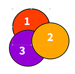
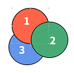
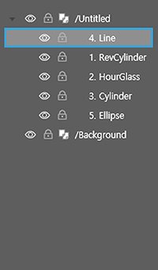

# 홈 탭 소개

## **홈 탭**

컨트롤 패널의 기본은 홈 탭 모드입니다. \[홈 탭\]에는 ①클립보드, ②도형 서식, ③개체 정렬, ⑥정렬, ⑤확대/축소, ⑥그룹, ⑦유실된 리소스 같은 객체를 편집하기 위한 편리 기능이 있습니다.

### **① 클립보드**

* 오려두기: 객체를 지웠다가 다시 붙이는 기능입니다.
* 복사하기: 객체를 복사하는 기능입니다.
* 붙이기: 복사한 것을 붙이는 기능입니다.

### **② 도형**

* X, Y: 객체의 위치를 나타내며 임의로 지정할 수 있습니다. \(단위는 px\)
* W, H: 객체의 크기\(너비와 높이\)를 나타내며 임의로 지정할 수 있습니다. \(단위는 px\)
* \(1\) 회전: 객체에 회전 값을 나타냅니다. \(단위는 radian\)
* \(2\) 불투명도: 객체의 불투명도를 나타냅니다.
* \(3\) 라운딩 크기: 사각형 가장자리의 둥근 정도를 나타냅니다.
* \(4\) 선 두께: 선의 굵기를 나타냅니다. \(단위는 px\)
* \(5\) 채움 색상: 객체 내부를 원하는 색상으로 채웁니다.
* \(6\) 테두리 색상: 객체 테두리의 색상을 나타냅니다.

### **③ 객체 정렬**

정렬은 여러 개의 레이어 모서리 위치를 맞추거나 간격을 적절하게 지정할 수 있는 도구입니다. 두 개 이상의 레이어를 선택한 후 원하는 방향의 정렬 및 배분 아이콘을 선택하시면 됩니다.

| 왼쪽 정렬 | 가운데\(수직\) 정렬 | 오른쪽 정렬 | 수직 중앙 정렬 |
| :---: | :---: | :---: | :---: |
|  |  |  |  |

| 상단 정렬 | 가운데\(수평\) 정렬 | 하단 정렬 | 수평 중앙 정렬 |
| :---: | :---: | :---: | :---: |
|  |  |  |  |

### **④ 정렬\(z-index\)**

객체를 선택한 후 정렬 아이콘을 선택하시면 객체의 배치 순서를 바꿀 수 있습니다.

| 현재 위치 \(2-3-1\) | 앞으로 가져오기 \(2-1-3\) | 맨 앞으로 가져오기 \(1-2-3\) |
| :---: | :---: | :---: |
|  |  |  |

| 현재 위치 \(1-2-3\) | 뒤로 보내기 \(2-1-3\) | 맨 뒤로 보내기 \(2-3-1\) |
| :---: | :---: | :---: |
|  |  |  |

객체의 정렬 순서\(z-index\)는 레이어 패널에서 확인할 수 있으며, 드래그앤드롭으로도 객체 순서를 바꿀 수 있습니다.

| 현재위치 | 앞으로 가져오기 | 맨앞으로 가져오기 |
| :---: | :---: | :---: |
|  |  |  |

###  **⑤ 그**룹

그룹으로 둘 이상의 객체를 묶어 하나의 객체처럼 다룰 수 있습니다.

| 그룹 지정 | 그룹 해제 |
| :---: | :---: |
| ​​ | ​ |

* 그룹 지정: 여러 개의 객체를 선택하고 그룹 아이콘을 클릭하면 그룹화됩니다.
* 그룹 해제: 그룹 해제 아이콘을 클릭하면 그룹이 해제됩니다.

| 그룹 지정 시 레이어 | 그룹 해제 시 레이어 |
| :---: | :---: |
|  |  |

그룹화는 레이어 패널에서 확인할 수 있으며, 드래그앤드롭으로도 그룹 순서를 바꿀 수 있습니다.

### **⑥ 확대/축소**

작업 창의 화면을 원하는 비율에 맞 확대/축소 할 수 있습니다.

### **⑦ 유실된 리소스**

유실된 리소스란 페이지빌더 문서에서 참조하고 있으나 실제 존재하지 않는 리소스\(이미지 파일, 액션\)를 의미합니다.

* \(1\) 파일 대치: 유실된 파일을 다른 파일로 대치합니다.
* \(2\) 폴더 대치: 폴더 전체의 파일들을 같은 이름의 파일로 대치합니다.

\[액션\] 항목에서 유실된 액션 효과를 선택하고 하단의 아이콘을 클릭하면 유실된 액션 경로를 찾을 수 있습니다.

