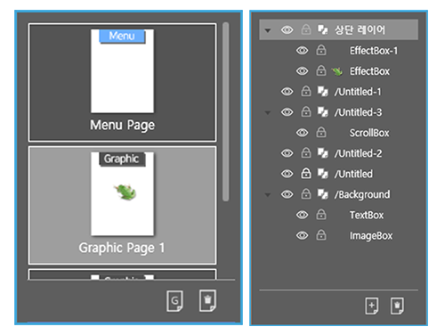
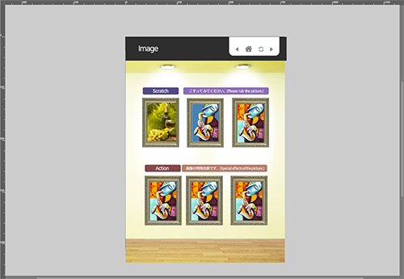
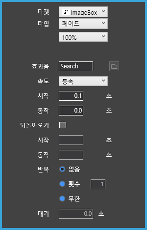

# 액션 작업 영역 소개

## 액션 작업 영역 소개

액션 작업 시  사용하는 액션 패널을 알아보겠습니다.

### ① 기본 컨트롤 패널

컨트롤 패널은 객체를 세부적으로 편집할 때 사용하는 기능들을 담고 있습니다. 예를 들어, 객체의 크기와 위치를 조절하는 기능과 색상을 변경하는 속성이 있습니다. 탭별로 여러 가지 기능을 볼 수 있습니다.

### ② 페이지, 레이어 패널

페이지, 레이어 패널에서 작업 중인 파일의 총 작업 페이지 갯수와 각 페이지에 있는 모든 레이어를 확인 할 수 있습니다.

### ③ 작업창

화면 중앙에 위치한 작업창에서 기본 그래픽 작업과 액션 작업이 가능합니다. 최종 결과물은 작업창 내에 있는 객체만 보입니다.

### ④ 액션 컨트롤러

액션 컨트롤러에서 페이지빌더의 모든 액션 트리거를 볼 수 있습니다. 액션 트리거는 특정 액션들이 작동되게 하는 조건이며, 사용자가 특정 액션을 해서 조건이 성립했을 때, 액션이 실행됩니다.

 1\) Page ①자동 2\) Touch ①누르기 ②떼기 ③드래그&드롭 ④드래그 3\) 사용자 ①조건부 ②라이브러리

### ⑤ 타임라인 뷰

시간별 순서대로 실행할 액션을 시각적으로 볼 수 있는 타임라인 뷰입니다. 액션이 실행될 순서가 선으로 연결되어 액션 진행 순서를 한눈에 편하게 알 수 있으며, 적용된 액션을 전체적으로 볼 수 있습니다. 타임라인에서 액션 추가, 삭제가 가능하며 액션 동작 시간 편집이 가능합니다. 여러 장의 시퀀스를 만들어 동시에 여러 가지 액션을 실행 할 수 있습니다.

### ⑥ 액션 속성 창

트리거와 타켓을 설정한 객체를 누르거나, 타임라인 뷰에서 액션을 선택하면 나오는 액션 속성 창입니다.

액션 타켓과 액션 타입을 선택할 수 있으며, 각각 액션 타입에 맞는 속성값을 볼 수 있습니다. 1px 이동과 0.1초 같은 세부 설정이 가능하며, 효과음과 반복 횟수 같은 부가 기능이 있습니다. 수정, 편집한 액션 속성값은 액션에 바로 적용되어 미리보기 창에서 수정된 액션을 볼 수 있습니다.

## 

