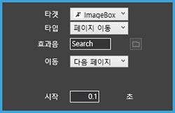

# 액션 타켓 살펴보기

## 액션 타켓 살펴보기

효과를 적용할 액션의 타켓을 정합니다.

* \(1\) 객체: 작업창 위에 올라가 있는 객체를 액션의 타켓으로 정합니다.
* \(2\) 조건부: 설정값이 맞는 경우에만 저장한 액션을 실행합니다. 
* \(3\) 라이브러리: 라이브러리에 추가한 액션을 실행합니다.
* \(4\) 사운드 1,2: 음성 파일\(.mp3 파일\)이 실행이 됩니다.
* \(5\) 링크: url를 입력해서 선택시에 새 창에서 열기 또는 다운로드가 가능합니다. 
* \(6\) 페이지: 페이지 전체가 타켓이 되어 페이지가 이동합니다.

### ① 객체

작업창 위에 올라가 있는 객체를 액션의 타켓으로 정합니다.

### ② 조건부

타겟으로 조건부를 설정하기전 사용자가 미리 조건부 설정을 해야합니다. 

조건부가 타켓일 경우 따로 액션 타입을 일일히 지정하지 않아도 사용자가 조건부에 미리 설정한 액션 타입이 실행됩니다. 조건부에 대한 설명은 액션 타입 → 조건부에서 볼 수 있습니다.

### ③ 라이브러리

사용자가 만들어 놓은 라이브러리를 타켓으로 설정이 가능합니다. 라이브 러리를 타켓으로 실행할 경우 라이브러리 액션이 순서대로 실행됩니다. ****라이브러리에 대한 자세한 설명은 액션 타입-라이브러리에서 볼 수 있습니다.

### ④ 사운드 1, 2 

사운드를 타켓으로 설정할 수 있습니다. 경로 옆 파일 아이콘을 눌러 mp3 파을 가져온 뒤, 사운드를 자동으로 재생하거나, 사용자가 원하는 구간만 반복해서 재생할 수 있습니다.

* 자동 : 사운드가 자동으로 실행됩니다. 
* 구간 설정 : 원하는 구간만 재생 가능합니다. 
* 구간 설정 시작 : 사운드 파일의 재생 시작 시간을 설정합니다.
* 구간 설정 끝 : 사운드 파일의 재생 끝 시간을 설정합니다. 
* 시작 : 액션 실행후 사운드 액션이 시작되는 시간을 지정합니다. 
* 반복 : 동작의 반복 횟수를 지정합니다. \(없음/횟수/무한\)

### ⑤ **링**크

URL를 입력해서 선택시에 새 창에서 열기 또는 다운로드가 가능합니다. 

* \(1\) 현재 창에서 열기 : 링크를 연결한 이미지를 클릭하시면 현재 보고있 창에서 연결한 URL 주소가 새로 열립니다. 
* \(2\) 새 창에서 열기 : 링크를 연결한 이미지를 클릭하면 새로운 창에서 연결한 URL 주소가 열립니다.
* \(3\) 다운로드 : 다운로드 링크를 연결한 이미지를 클릭하면 연결한 다운로드 링크가 열려 파일이 다운로드 됩니다.

### ⑥ 페이지

**\[페이지\]** 작업 중인 페이지가 타켓이 되어 html 파일 내에서 페이지 이동이 자유롭게 가능합니다.

* 다음 페이지: 다음 페이지로 이동합니다.
* 이전 페이지: 이전 페이지로 이동합니다.
* 보던 페이지: 현재 페이지가 나타납니다.
* 홈: 메뉴 페이지로 이동합니다.
* 입력: 입력한 번호의 페이지로 이동합니다.

## \*\*\*\*

