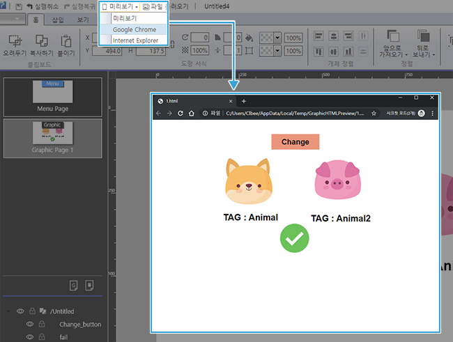

# 액션 적용 세부 과정 -2. 타켓 선택

액션 적용 과정은 크게 액션을 실행시킬 객체 선택, 액션 실행 조건인 트리거 선택, 액션이 적용될 액션 타켓, 어떤 액션을 나타낼지 선택하는 액션 타입 선택하는 과정입니다. 총 3번의 선택으로 여러 가지 액션을 만들 수 있습니다. 액션 트리거, 타켓, 타입별 종류를 알고 있으면, 액션을 응용해서 더욱 다양한 액션을 만들 수 있습니다.

## 2. 액션 타켓 종류

트리거 조건이 맞았을 때, 액션이 실행될 타켓을 선택합니다. 작업창 위에 있는 모든 객체 이외의 사용자 조건과 보조 액션 기능들을 타켓으로 선택할 수 있습니다.

* 객체: 작업창 위에 있는 모든 객체를 타켓으로 지정할 수 있습니다.
* 조건부: 미리 태그 비교 값을 설정한 조건부 액션을 실행합니다. 
* 라이브러리: 미리 라이브러리에 넣은 모든 액션을 순서대로 실행합니다. 
* 사운드 1,2: 음성 파일\(.mp3 파일\)이 실행이 됩니다. 
*  페이지: 페이지 전체가 타켓이 되어 페이지가 액션이 실행됩니다. 


페이지 타켓은 ‘떼기’ 트리거에서만 지정할 수 있습니다.


### **①** 액션 타켓 세부 설명 - 객체

작업창 위에 올라간 모든 레이어는 액션 타입으로 설정이 가능합니다. 한 액션 당 한 개의 타켓만 설정이 가능합니다. 

### ②  액션 타켓 세부 설명 - 조건부

액션 타켓으로 조건부를 설정하기 위해선 먼저 조건부 액션이 있어야 합니다. 액션 타겟으로 조건부을 실행시키면, 미리 만들어 놓은 조건부 태그 비교 액션이 실행됩니다. 

### ③ 액션 타켓 세부 설명 - 라이브러리 

사용자가 만들어 놓은 라이브러리를 타켓으로 설정이 가능합니다. 라이브 러리를 타켓으로 실행할 경우 라이브러리 액션이 순서대로 실행됩니다. ****라이브러리에 대한 자세한 설명은 액션 타입-라이브러리에서 볼 수 있습니다.

### ④ 액션 타켓 세부 설명 - 사운드 1, 2

사운드를 타켓으로 설정할 수 있습니다. 경로 옆 파일 아이콘을 눌러 mp3 파일을 불러온 뒤, 사운드를 자동으로 재생하거나, 사용자가 원하는 구간만 반복해서 재생할 수 있습니다. 


사운드 재생은 'mp3' 파일만 가능합니다.


#### \[사운드 액션 타입\]

* 자동 : 사운드가 자동으로 실행됩니다. 
* 구간 설정 : 원하는 구간만 재생 가능합니다. 
* 구간 설정 시작 : 사운드 파일의 재생 시작 시간을 설정합니다.
* 구간 설정 끝 : 사운드 파일의 재생 끝 시간을 설정합니다. 
* 시작 : 액션 실행후 사운드 액션이 시작되는 시간을 지정합니다. 
* 반복 : 동작의 반복 횟수를 지정합니다. \(없음/횟수/무한\)

### ⑤ 액션 액션 타켓 세부 설명 - 페이지

 \[페이지\] 작업 중인 페이지가 타켓이 되어 html 파일 내에서 페이지 이동이 자유롭게 가능합니다. 

#### \[페이지 액션 타입\]

* 다음 페이지: 다음 페이지로 이동합니다. 
* 이전 페이지: 이전 페이지로 이동합니다. 
* 보던 페이지: 현재 페이지가 나타납니다. 
* 홈: 메뉴 페이지로 이동합니다. 
* 입력: 입력한 번호의 페이지로 이동합니다.

## \*\*\*\*

