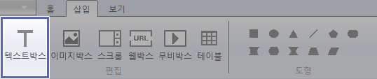
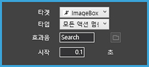
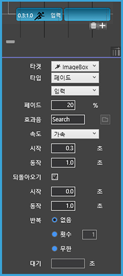
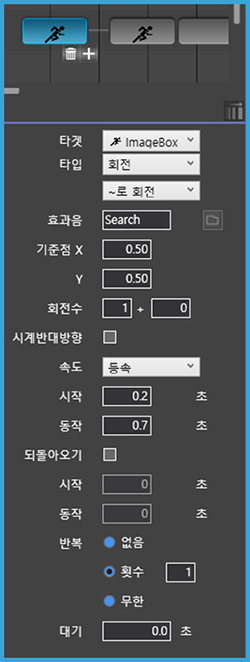
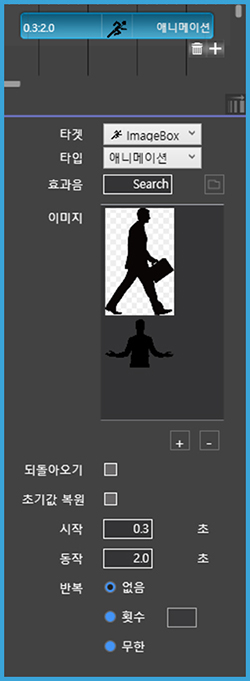

# 액션 타입 - 1. 움직임 효과

## 액션 타입 - 1. 움직임 효과

액션 타입에서 다양한 움직임 효과를 선택할 수 있습니다.

### **\[모든 액션 멈춤\]**

#### **\[모든 액션 멈춤\]** 은 모든 액션의 동작을 멈춥니다.

* 효과음: 동작 정지 시 지정한 효과음\(.mp3 파일\)의 소리가 납니다.
* 시작: 액션이 시작되는 시간을 지정합니다.

### **\[보기/감추기\]**

  

#### **\[보기/감추기\]** 는 객체를 화면에서 보이거나 숨깁니다.

* 효과음: 동작 정지 시 지정한 효과음\(.mp3 파일\)의 소리가 납니다.
* 시작: 액션이 시작되는 시간을 지정합니다.

### **\[페이드\]**

  

#### **\[페이드\]** 는 객체의 불투명도를 조절합니다.

* 페이드 100%: 선택한 타켓이 완전히 다 보입니다.
* 페이드 0%: 선택한 타켓이 완전히 안보입니다. 
* 페이드 입력: 0%~100% 사이의 값을 입력해서 불투명도를 조절합니다.
* 효과음: 동작 정지 시 지정한 효과음\(.mp3 파일\)의 소리가 납니다.
* 속도: 액션 속도를 선택합니다. \(등속/가속/감속/가속 후 감속\)
* 동작: 액션의 동작 지속 시간을 지정할 수 있습니다. 
* 되돌아오기: 체크하면 효과를 반대로 실행해 원래 상태로 돌아옵니다. 
* 반복: 동작의 반복 횟수를 지정합니다. \(없음/횟수/무한\)
* 대기: 반복 실행 시 액션 재시작 전 대기 시간을 정할 수 있습니다.

### **\[이동\]**

  

#### **\[이동\]** 은 객체를 원하는 곳으로 이동시킵니다.

* '~로 이동/~만큼 이동/곡선 이동': 이동 방법을 선택합니다.
* 효과음: 동작 정지 시 지정한 효과음\(.mp3 파일\)의 소리가 납니다.
* x축 이동, y축 이동: 입력한 만큼 x축과 y축으로 이동합니다. \(객체를 마우스로 움직여 이동시킬 위치를 정하셔도 됩니다.\) 
* 속도: 액션의 속도를 조절합니다. \(등속/가속/감속/가속 후 감속\)
* 시작: 액션의 시작 시간을 지정합니다.
* 동작: 액션의 동작 지속 시간을 지정합니다. \(반드시 지정해야 액션이 움직입니다.\) 
* 되돌아오기: 체크하면 효과를 반대로 실행해 원래 상태로 돌아옵니다. 
* 반복: 동작의 반복 횟수를 지정합니다. \(없음/횟수/무한\)
* 대기: 반복 실행 시 액션 재시작 전 대기 시간을 정할 수 있습니다.

### **\[확대이동\]**

  

#### **\[확대이동\]** 은 객체의 크기를 조절하고 이동합니다.

* 효과음: 동작 정지 시 지정한 효과음\(.mp3 파일\)의 소리가 납니다.
* '좌표 X, Y': 객체를 이동시킬 X와 Y축 위치를 지정할 수 있습니다. \(객체를 마우스로 움직여 이동시킬 위치를 정하셔도 됩니다.\)
* '크기 W, H': 객체의 크기를 지정할 수 있습니다. \(객체를 마우스로 확대/축소시켜 변형할 객체의 모습을 정할 수 있습니다.\)
* 속도: 액션의 속도를 조절합니다. \(등속/가속/감속/가속 후 감속\)
* 시작: 액션의 시작 시간을 지정합니다.
* 동작: 액션의 동작 지속 시간을 지정할 수 있습니다. 
* 되돌아오기: 체크하면 효과를 반대로 실행해 원래 상태로 돌아옵니다. 
* 반복: 동작의 반복 횟수를 지정합니다. \(없음/횟수/무한\)
* 대기: 반복 실행 시 액션 재시작 전 대기 시간을 정할 수 있습니다.

### **\[회전\]**

  

#### **\[회전\]** 은 객체를 회전시킵니다.

* '~로 회전, ~만큼 회전': 객체의 회전 방법을 선택합니다.
* 효과음: 동작 정지 시 지정한 효과음\(.mp3 파일\)의 소리가 납니다.
* 기준점 X, Y: 회전의 기준점이 되는 좌표를 정합니다.
* 회전수: 360도로 회전할 횟수를 정합니다.
* 시계반대방향: 시계 반대 방향으로 회전합니다
* 속도: 액션의 속도를 조절합니다. \(등속/가속/감속/가속 후 감속\)
* 동작: 액션의 동작 지속 시간을 지정할 수 있습니다. 
* 되돌아오기: 체크하면 효과를 반대로 실행해 원래 상태로 돌아옵니다. 
* 반복: 동작의 반복 횟수를 지정합니다. \(없음/횟수/무한\)
* 대기: 반복 실행 시 액션 재시작 전 대기 시간을 정할 수 있습니다.

### **\[뒤집기\]**

  

#### **\[뒤집기\]** 는 객체를 가로, 세로 방향으로 뒤집습니다.

* '가로 뒤집기/세로 뒤집기': 타켓이 뒤집히는 방향을 정합니다.
* 효과음: 동작 정지 시 지정한 효과음\(.mp3 파일\)의 소리가 납니다.
* 속도: 액션의 속도를 조절합니다. \(등속/가속/감속/가속 후 감속\)
* 시작: 액션의 시작 시간을 지정합니다.
* 동작: 액션의 동작 지속 시간을 지정할 수 있습니다. 
* 되돌아오기: 체크하면 효과를 반대로 실행해 원래 상태로 돌아옵니다. 
* 반복: 동작의 반복 횟수를 지정합니다. \(없음/횟수/무한\)
* 대기: 반복 실행 시 액션 재시작 전 대기 시간을 정할 수 있습니다.

### **\[애니메이션\]**

  

#### **\[애니메이션\]** 은 여러장의 이미지가 순서대로 바뀌면서 보여집니다.

> '누르기 모드'에서는 실행되지 않습니다.

* 효과음: 동작 정지 시 지정한 효과음\(.mp3 파일\)의 소리가 납니다.
* 이미지: 순서대로 보여질 적용할 이미지를 추가하거나 삭제합니다.
* 되돌아오기: 체크하면 효과를 반대로 실행해 원래 상태로 돌아옵니다. 
* 초기값 복원: 애니메이션이 끝나면 처음 이미지가 나타납니다.
* 시작: 애니메이션의 시작 시간을 지정할 수 있습니다. 
* 동작: 애니메이션 동작 지속 시간을 지정할 수 있습니다. 
* 반복: 동작의 반복 횟수를 지정합니다. \(없음/횟수/무한\)

