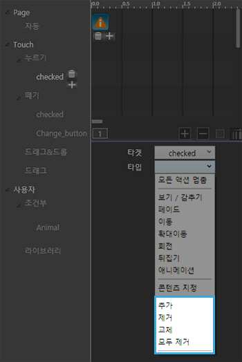
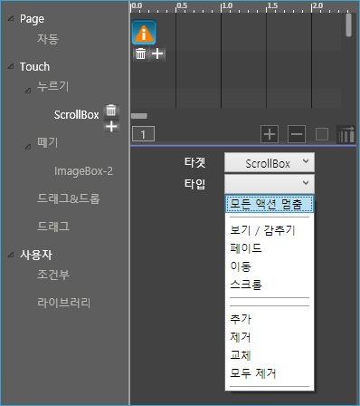

# 액션 적용 세부 과정 -3. 액션 타입 선택 \(움직임, 콘텐츠 지정\)

액션 적용 과정은 크게 액션을 실행시킬 객체 선택, 액션 실행 조건인 트리거 선택, 액션이 적용될 액션 타켓, 어떤 액션을 나타낼지 선택하는 액션 타입 선택하는 과정입니다. 총 3번의 선택으로 여러 가지 액션을 만들 수 있습니다. 액션 트리거, 타켓, 타입별 종류를 알고 있으면, 액션을 응용해서 더욱 다양한 액션을 만들 수 있습니다.

## 3. 액션 타입 종류 - 움직임 효과

액션 타입에서 다양한 움직임 효과를 선택할 수 있습니다.

* 모든 액션 멈춤
* 움직임 효과 · 보기/ 감추기 · 페이드 · 이동 · 확대이동 · 회전 · 뒤집기 · 애니메이션 · 스크롤
* 콘텐츠 지정 
* 태그값 변경 액션 · 추가 · 제거 · 교체 · 모두 제거


태그값 변경 액션에 대한 자세한 설명은 '조건부 태그 변경 액션 소개' 목차에 있습니다.


### ▣ 스크롤 박스 사용시에만 적용할 수 있는 액션 종류

* 모든 액션 멈춤
* 움직임 효과 · 보기/ 감추기 · 페이드 · 이동 ·  스크롤
* 태그값 변경 액션 · 추가 · 제거 · 교체 · 모두 제거

## **① 모든 액션 멈춤**

#### **\[모든 액션 멈춤\]** 은 모든 액션의 동작을 멈춥니다.

* 효과음: 동작 정지 시 지정한 효과음\(.mp3 파일\)의 소리가 납니다.
* 시작: 액션이 시작되는 시간을 지정합니다.

## **② 보기/감추기**

  

#### **\[보기/감추기\]** 는 객체를 화면에서 보이거나 숨깁니다.

* 효과음: 동작 정지 시 지정한 효과음\(.mp3 파일\)의 소리가 납니다.
* 시작: 액션이 시작되는 시간을 지정합니다.


보기/감추기 효과를 위해선 기본 컨트롤 패널에 있는 박스탭에서 시작할 때 감추기 효과를 선택해야 합니다.


## **③ 페이드**

  

#### **\[페이드\]** 는 객체의 불투명도를 조절합니다.

* 페이드 100%: 선택한 타켓이 완전히 다 보입니다.
* 페이드 0%: 선택한 타켓이 완전히 안보입니다. 
* 페이드 입력: 0%~100% 사이의 값을 입력해서 불투명도를 조절합니다.
* 효과음: 동작 정지 시 지정한 효과음\(.mp3 파일\)의 소리가 납니다.
* 속도: 액션 속도를 선택합니다. \(등속/가속/감속/가속 후 감속\)
* 동작: 액션의 동작 지속 시간을 지정할 수 있습니다. 
* 되돌아오기: 체크하면 효과를 반대로 실행해 원래 상태로 돌아옵니다. 
* 반복: 동작의 반복 횟수를 지정합니다. \(없음/횟수/무한\)
* 대기: 반복 실행 시 액션 재시작 전 대기 시간을 정할 수 있습니다.


페이드 효과를 쓰기 위해선 객체의 투명도를 조절해야합니다.


## **④ 이동**

  

#### **\[이동\]** 은 객체를 원하는 곳으로 이동시킵니다.

* '~로 이동/~만큼 이동/곡선 이동': 이동 방법을 선택합니다.
* **~로 이동 : 이동시킬 위치를 지정합니다.**
* **~만큼 이동 : 이동할 위치를 선택하면 그 간격만큼 액션이 실행됩니다.** 
* **곡선 이동 : 작업창에 생성된 곡선 라인을 조절하면 곡선을 따라서 객체가 움직입니다.**
* 효과음: 동작 정지 시 지정한 효과음\(.mp3 파일\)의 소리가 납니다.
* x축 이동, y축 이동: 입력한 만큼 x축과 y축으로 이동합니다. \(객체를 마우스로 움직여 이동시킬 위치를 정하셔도 됩니다.\) 
* 속도: 액션의 속도를 조절합니다. \(등속/가속/감속/가속 후 감속\)
* 시작: 액션의 시작 시간을 지정합니다.
* 동작: 액션의 동작 지속 시간을 지정합니다. \(반드시 지정해야 액션이 움직입니다.\) 
* 되돌아오기: 체크하면 효과를 반대로 실행해 원래 상태로 돌아옵니다. 
* 반복: 동작의 반복 횟수를 지정합니다. \(없음/횟수/무한\)
* 대기: 반복 실행 시 액션 재시작 전 대기 시간을 정할 수 있습니다.

## **⑤ 확대이동**

  

#### **\[**확대이동\] 은 객체의 크기를 조절하고 이동합니다. 확대이동 선택 후 마우스로 객체의 크기를 조절해야 합니다.

* 효과음: 동작 정지 시 지정한 효과음\(.mp3 파일\)의 소리가 납니다.
* '좌표 X, Y': 객체를 이동시킬 X와 Y축 위치를 지정할 수 있습니다. \(객체를 마우스로 움직여 이동시킬 위치를 정하셔도 됩니다.\)
* '크기 W, H': 객체의 크기를 지정할 수 있습니다. \(객체를 마우스로 확대/축소시켜 변형할 객체의 모습을 정할 수 있습니다.\)
* 속도: 액션의 속도를 조절합니다. \(등속/가속/감속/가속 후 감속\)
* 시작: 액션의 시작 시간을 지정합니다.
* 동작: 액션의 동작 지속 시간을 지정할 수 있습니다. 
* 되돌아오기: 체크하면 효과를 반대로 실행해 원래 상태로 돌아옵니다. 
* 반복: 동작의 반복 횟수를 지정합니다. \(없음/횟수/무한\)
* 대기: 반복 실행 시 액션 재시작 전 대기 시간을 정할 수 있습니다.

## **⑥ 회전**

  

#### **\[회전\]** 은 객체를 회전시킵니다.

* '~로 회전, ~만큼 회전': 객체의 회전 방법을 선택합니다.
* **~로 회전 : 회전시킨 각도까지만 회전합니다.** 
* **~ 만큼 회전 : 회전시킨 각도만큼 계속 회전합니다.**
* 효과음: 동작 정지 시 지정한 효과음\(.mp3 파일\)의 소리가 납니다.
* 기준점 X, Y: 회전의 기준점이 되는 좌표를 정합니다.
* 회전수: 360도로 회전할 횟수를 정합니다.
* 시계반대방향: 시계 반대 방향으로 회전합니다
* 속도: 액션의 속도를 조절합니다. \(등속/가속/감속/가속 후 감속\)
* 동작: 액션의 동작 지속 시간을 지정할 수 있습니다. 
* 되돌아오기: 체크하면 효과를 반대로 실행해 원래 상태로 돌아옵니다. 
* 반복: 동작의 반복 횟수를 지정합니다. \(없음/횟수/무한\)
* 대기: 반복 실행 시 액션 재시작 전 대기 시간을 정할 수 있습니다.

## **⑦ 뒤집기**

  

#### **\[뒤집기\]** 는 객체를 가로, 세로 방향으로 뒤집습니다.

* '가로 뒤집기/세로 뒤집기': 타켓이 뒤집히는 방향을 정합니다.
* 효과음: 동작 정지 시 지정한 효과음\(.mp3 파일\)의 소리가 납니다.
* 속도: 액션의 속도를 조절합니다. \(등속/가속/감속/가속 후 감속\)
* 시작: 액션의 시작 시간을 지정합니다.
* 동작: 액션의 동작 지속 시간을 지정할 수 있습니다. 
* 되돌아오기: 체크하면 효과를 반대로 실행해 원래 상태로 돌아옵니다. 
* 반복: 동작의 반복 횟수를 지정합니다. \(없음/횟수/무한\)
* 대기: 반복 실행 시 액션 재시작 전 대기 시간을 정할 수 있습니다.

## **⑧ 애니메이션**

  

#### **\[애니메이션\]** 은 여러장의 이미지가 순서대로 바뀌면서 보여집니다. 여러장의 연속된 이미지를 넣을 경우 애니메이션이 실행되는 것처럼 보이게 할 수 있습니다.


'누르기 ' 트리에서는 실행되지 않습니다.


* 효과음: 동작 정지 시 지정한 효과음\(.mp3 파일\)의 소리가 납니다.
* 이미지: 순서대로 보여질 적용할 이미지를 추가하거나 삭제합니다.
* 되돌아오기: 체크하면 효과를 반대로 실행해 원래 상태로 돌아옵니다. 
* 초기값 복원: 애니메이션이 끝나면 처음 이미지가 나타납니다.
* 시작: 애니메이션의 시작 시간을 지정할 수 있습니다. 
* 동작: 애니메이션 동작 지속 시간을 지정할 수 있습니다. 
* 반복: 동작의 반복 횟수를 지정합니다. \(없음/횟수/무한\)

## ⑨ 스크롤

#### \[스크롤\]은 스크롤 박스 안에서 원하는 위치로 스크롤 영역이 이동할 수 있게하는 액션입니다. X,Y축에 원하는 이동 위치를 입력하거나, 입력하지 않을 시에는 맨 위로 스크롤 업이 됩니다.


스크롤 박스 사용시에만 사용할 수 있습니다.


* 효과음: 동작 정지 시 지정한 효과음\(.mp3 파일\)의 소리가 납니다.
* x축 이동, y축 이동: 입력한 만큼 스크롤 박스  x축과 y축으로 이동합니다. 
* 시작: 액션의 시작 시간을 지정합니다.
* 동작: 액션의 동작 지속 시간을 지정할 수 있습니다. 
* 되돌아오기: 체크하면 효과를 반대로 실행해 원래 상태로 돌아옵니다. 
* 반복: 동작의 반복 횟수를 지정합니다. \(없음/횟수/무한\)
* 대기: 반복 실행 시 액션 재시작 전 대기 시간을 정할 수 있습니다.

## 3. 액션 타입 종류 - 콘텐츠 지정

기존의 콘텐츠가 지정한 콘텐츠로 바뀌어서 나옵니다.


현재 이미지 박스만 컨텐츠 지정이 가능합니다.


\(1\) 현재 콘텐츠를 올려놓은 타켓의 타입을 콘텐츠 지정으로 선택합니다.

\(2\) 폴더 아이콘을 눌러 새로 불러올 콘텐츠를 선택합니다.

\(3\) 사용자 행동 후 기존의 콘텐츠가 새로 불러온 콘텐츠로 바뀌어서 나타납니다.

