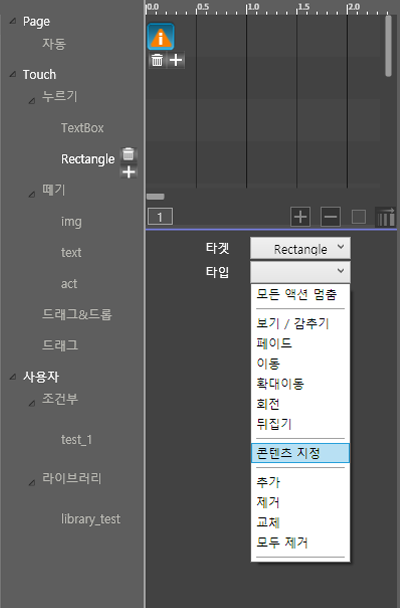
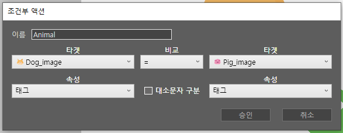
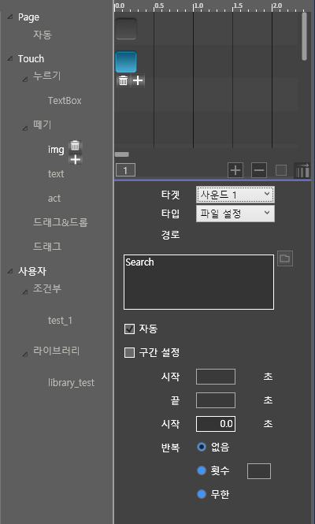
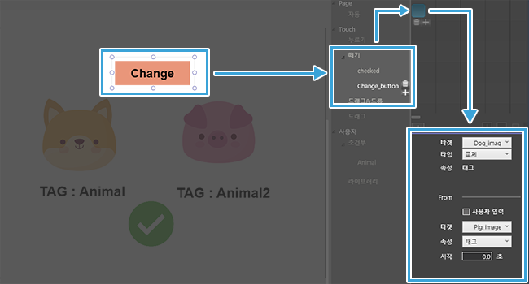
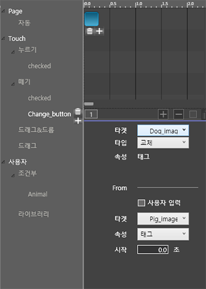

# 액션 타입 - 3. 태그값 액션 \(조건부\)

## **3. 조건부 액션 넣**기

태그값 변경 액션을 이용하여 액션을 다양하게 만들 수 있습니다. 조건부 액션을 만드는 방법과 태그값 변경 액션에 대해 자세히 알아보겠습니다.‌

## ① 조건부 액션 넣기 

태그값 변경 액션을 하기 위해선 먼저 조건부 액션이 있어야합니다.

조건부 액션은 여러개의 타겟에 지정한 태그를 비교하여 액션을 실행합니다.‌ 조건이 맞을 경우\(True\)와 아닐 경우\(False\)에 액션을 지정해서 사용자 상황에 맞게 액션이 나타납니다.‌ 

### ▣ 조건부 만들기 \(기본\) 

\(1\) 조건을 비교할 타겟 태그값을 입력합니다.

> 삽입 리본 메뉴 맨 왼쪽 이름 밑에 태그 입력칸이 있습니다. 대소문자, 띄어쓰기 구분이 가능합니다. 태그 입력칸엔 한개의 태그만 작성할 수 있습니다.

\(2\) 태그를 입력한 타켓을 선택해서 조건부 액션 추가 버튼을 선택합니다.

\(3\) 속성창에서 조건부 이름과 타켓의 태그 값을 어떻게 비교할 건지 정합니다.

> 사용자 입력 \(Userinput\)과도 비교가 가능합니다. 오른쪽 타켓을 사용자입력으로 하고, 속성칸에 텍스트를 입력합니다.

| 비교 | 설명 |
| :--- | :--- |
| = | 태그가 같을때 O \(true\) 액션 |
| ≠ | 태그가 같지 않을때 O \(true\) 액션 |
| 포함 | 현재 타켓의 태그에 비교할 타켓의 태그가 포함되는 경우 O \(true\) 액션 |
| 전체 포함 | 현재 타켓이 가진 전체 태그와 비교할 타켓의 태그가 모두 포함되는 경우에만 O \(true\) 액션 |

\(4\) 비교 조건이 맞을 때와 맞지 않을 때 나타낼 액션을 지정합니다.

\(5\) 조건부 설정을 완료한 후, 조건부 액션을 실행할 확인 버튼을 만들어 액션을 추가합니다.‌

\(6\) 버튼의 타켓을 조건부로 설정합니다.

> 자동, 떼기, 누르기, 드래그 앤 드랍 모드에서만 조건부를 타켓으로 지정할 수 있습니다.

\(7\) 미리 보기로 조건부 액션을 확인합니다.‌

## ② 태그값 변경 

타켓의 태그값에 다른 타켓의 태그값을 추가하거나, 교체, 제거해서 다양하게 조건부 액션을 활용할 수 있습니다.

<table>
  <thead>
    <tr>
      <th style="text-align:left">&#xD0DC;&#xADF8;&#xAC12; &#xBCC0;&#xACBD;</th>
      <th style="text-align:left">&#xC124;&#xBA85;</th>
    </tr>
  </thead>
  <tbody>
    <tr>
      <td style="text-align:left">&#xCD94;&#xAC00;</td>
      <td style="text-align:left">&#xD604;&#xC7AC; &#xD0C0;&#xCF13;&#xC758; &#xD0DC;&#xADF8;&#xC5D0; &#xB2E4;&#xB978;
        &#xD0C0;&#xCF13;&#xC758; &#xD0DC;&#xADF8;&#xAC00; &#xCD94;&#xAC00; &#xB429;&#xB2C8;&#xB2E4;.</td>
    </tr>
    <tr>
      <td style="text-align:left">&#xAD50;&#xCCB4;</td>
      <td style="text-align:left">&#xD604;&#xC7AC; &#xD0C0;&#xCF13;&#xC758; &#xD0DC;&#xADF8;&#xAC00; &#xB2E4;&#xB978;
        &#xD0C0;&#xCF13;&#xC758; &#xD0DC;&#xADF8;&#xB85C; &#xAD50;&#xCCB4; &#xB429;&#xB2C8;&#xB2E4;.</td>
    </tr>
    <tr>
      <td style="text-align:left">&#xC0AD;&#xC81C;</td>
      <td style="text-align:left">&#xD604;&#xC7AC; &#xD0C0;&#xCF13;&#xC758; &#xD0DC;&#xADF8;&#xC5D0;&#xC11C;
        &#xB2E4;&#xB978; &#xD0C0;&#xCF13;&#xC774; &#xD0DC;&#xADF8;&#xAC00; &#xAC19;&#xC744;
        &#xACBD;&#xC6B0;&#xC5D0;&#xB9CC; &#xD0DC;&#xADF8;&#xAC00; &#xC0AD;&#xC81C;&#xB429;&#xB2C8;&#xB2E4;.</td>
    </tr>
    <tr>
      <td style="text-align:left">&#xC804;&#xCCB4;&#xC0AD;&#xC81C;</td>
      <td style="text-align:left">&#xD0C0;&#xCF13;&#xC758; &#xAE30;&#xC874; &#xD0DC;&#xADF8;&#xAC12;&#xC744;
        &#xD3EC;&#xD568;&#xD558;&#xC5EC; &#xBAA8;&#xB4E0; &#xD0DC;&#xADF8;&#xAC00;
        &#xC0AD;&#xC81C;&#xB429;&#xB2C8;&#xB2E4;.</td>
    </tr>
    <tr>
      <td style="text-align:left">*&#xC0AC;&#xC6A9;&#xC790;&#xC785;&#xB825;</td>
      <td style="text-align:left">
        
(&#xC704;&#xC758; &#xD0DC;&#xADF8;&#xAC12; &#xBCC0;&#xACBD; &#xD0C0;&#xC785;
          &#xC120;&#xD0DD; &#xD6C4; &#xB098;&#xD0C0;&#xB0A8;)

        
&#xC0AC;&#xC6A9;&#xC790;&#xAC00; &#xC785;&#xB825;&#xD55C; &#xD0DC;&#xADF8;&#xB85C;
          &#xD604;&#xC7AC; &#xD0C0;&#xCF13;&#xC758; &#xD0DC;&#xADF8;&#xAC00; &#xBCC0;&#xACBD;&#xB429;&#xB2C8;&#xB2E4;.

      </td>
    </tr>
  </tbody>
</table>## ③ 태그값 변경 액션 넣기 

\(1\) 기본 조건부 액션을 만듭니다.

\(2\) 태그값 변경 액션을 실행시킬 타켓을 선택해 액션을 설정합니다.

> 태그를 비교할 타켓을 변경 액션을 실행시킬 타켓과 다르게 지정할 수 있습니다.

‌

\(3\) 타입을 태그값 변경 태그 중 하나로 선택합니다.

\(4\) 아래 속성칸에서 태그를 변경시킬 타켓를 선택합니다.

> 사용자 입력 \(Userinput\)를 선택하시면 사용자 입력칸이 나타납니다. 사용자가 입력한 태그값으로 태그가 변경됩니다.

\(5\) 태그값 변경 액션을 넣은 타켓을 선택하시면 미리 지정한 타켓의 태그값이 변경됩니다.

