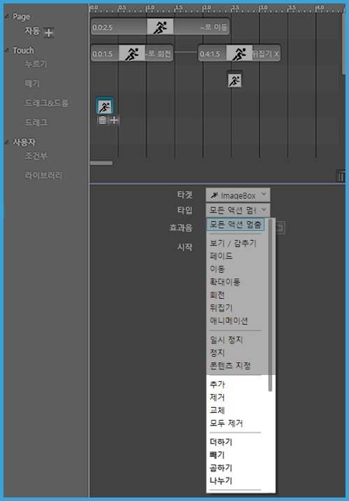

# 액션 타입 - 2. 정지 / 3. 태그값

## 액션 타입 -2. 액션 정지

액션을 정지하거나, 콘텐츠를 바꿀 수 있습니다.

* 일시 정지: 지정한 타켓의 액션을 잠깐 멈춥니다.
* 정지: 지정한 타켓의 액션을 멈춥니다.
* 콘텐츠 지정: 객체의 콘텐츠를 바꿀 수 있습니다.

## **액션 타입 -3. 태그값**

액션의 태그 값에 따라 다양한 속성을 넣을 수 있습니다.

* 추가: 태그에 값을 추가합니다. \("He"+"llo"="Hello", 30+40=3040\)
* 제거: 태그에 값을 제거합니다.
* 교체: 태그 값을 바꿉니다.
* 모두 제거: 태그 값을 모두 삭제합니다.
* 더하기: 태그에 값을 더합니다. \("He"+"llo"="Hello", 30+40=70\)
* 빼기: 태그에 값을 뺍니다. 
* 곱하기: 태그에 값을 곱합니다.
* 나누기: 태그에 값을 나눕니다.

