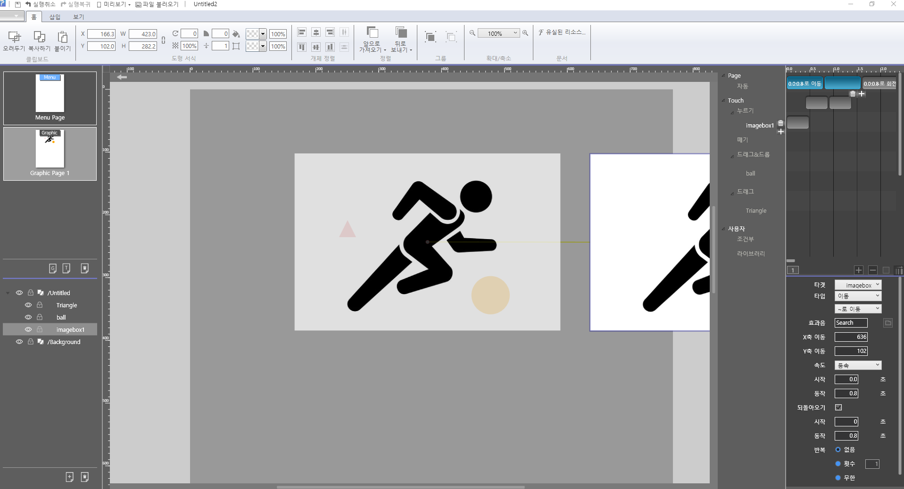

# 페이지 빌더 액션 소개

## 액션 효과

액션은 페이지빌더의 핵심 기능 중에 하나로서 그래픽 애니메이션과 사용자와의 인터랙션을 처리합니다.

액션 패널에서는 시간의 흐름에 따른 액션을 지정할 수 있습니다. 객체에 적용할 수 있는 다양한 애니메이션 효과를 제공하며, 사용자의 행동 조건인 누르기 \(마우스 클릭\), 떼기\(마우스 업\)와 같은 다양한 트리거를 제공합니다. 

