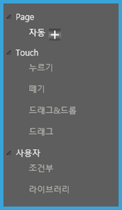

# 액션 패널 살펴보기

액션 패널에서는 시간의 흐름에 따른 액션을 지정할 수 있습니다. 객체에 적용할 수 있는 다양한 애니메이션 효과와 자동실행, 누르기\(mouse down\), 떼기\(mouse up\)와 같은 다양한 액션 기능을 제공합니다.

## **액션 패널 기본 정보**

액션 패널은 액션 컨트롤러, 타임라인 상태표시, 액션 속성 창으로 구성됩니다.

### **① 액션 컨트롤러**

액션 컨트롤러에는 Page, Touch, 사용자와 같은 특정한 동작에 필요한 액션을 표시됩니다.

> 모드별 액션 설명

<table>
  <thead>
    <tr>
      <th style="text-align:left">&#xBAA8;&#xB4DC;</th>
      <th style="text-align:left">&#xC561;&#xC158;</th>
    </tr>
  </thead>
  <tbody>
    <tr>
      <td style="text-align:left">Page</td>
      <td style="text-align:left">&#xC790;&#xB3D9; : &#xD398;&#xC774;&#xC9C0; &#xC2E4;&#xD589;&#xC2DC; &#xC790;&#xB3D9;&#xC73C;&#xB85C;
        &#xC2E4;&#xD589;&#xB429;&#xB2C8;&#xB2E4;.</td>
    </tr>
    <tr>
      <td style="text-align:left">Touch</td>
      <td style="text-align:left">
        
&#xB204;&#xB974;&#xAE30; : &#xAC1D;&#xCCB4; &#xD074;&#xB9AD; &#xC0C1;&#xD0DC;&#xC5D0;&#xC11C;
          &#xC561;&#xC158;&#xC774; &#xC2E4;&#xD589;&#xB429;&#xB2C8;&#xB2E4;.

        
&#xB5BC;&#xAE30; : &#xAC1D;&#xCCB4;&#xC5D0;&#xC11C; &#xBC84;&#xD2BC; &#xC5C5;
          &#xC0C1;&#xD0DC;&#xC5D0;&#xC11C; &#xC561;&#xC158;&#xC774; &#xC2E4;&#xD589;&#xB429;&#xB2C8;&#xB2E4;.

        
&#xB4DC;&#xB798;&#xADF8;&amp;&#xB4DC;&#xB86D; : &#xAC1D;&#xCCB4;&#xB97C;
          &#xB2E4;&#xB978; &#xACF3;&#xC73C;&#xB85C; &#xB04C;&#xC5B4;&#xB2E4; &#xB193;&#xC744;
          &#xB54C; &#xC561;&#xC158;&#xC774; &#xC2E4;&#xD589;&#xB429;&#xB2C8;&#xB2E4;.

        
&#xB4DC;&#xB798;&#xADF8; : &#xAC1D;&#xCCB4;&#xB97C; &#xB4DC;&#xB798;&#xADF8;
          &#xD560; &#xB54C; &#xC561;&#xC158;&#xC774; &#xC2E4;&#xD589;&#xB429;&#xB2C8;&#xB2E4;.

      </td>
    </tr>
    <tr>
      <td style="text-align:left">&#xC0AC;&#xC6A9;&#xC790;</td>
      <td style="text-align:left">
        
&#xC870;&#xAC74;&#xBD80; : &#xD0C0;&#xAC9F;&#xACFC; &#xC18D;&#xC131;&#xC744;
          &#xBE44;&#xAD50;&#xD55C; &#xC124;&#xC815;&#xAC12;&#xC744; &#xC800;&#xC7A5;&#xD569;&#xB2C8;&#xB2E4;.

        
&#xB77C;&#xC774;&#xBE0C;&#xB7EC;&#xB9AC; : &#xB77C;&#xC774;&#xBE0C;&#xB7EC;&#xB9AC;&#xC5D0;
          &#xC124;&#xC815;&#xD55C; &#xC561;&#xC158;&#xC744; &#xC800;&#xC7A5;&#xD569;&#xB2C8;&#xB2E4;.

      </td>
    </tr>
  </tbody>
</table>드래그&드롭시 드래그를 할 수 있는 범위인 드래그 영역과 드롭 효과가 나타나는 부분인 액션 영역을 지정할 수 있습니다.

드래그&드롭 효과를 넣을 객체를 선택하고 사용자 모드 패널 위에 나타나는 i 아이콘을 누르시면 작업창에 파란색, 보라색 박스가 나타납니다. 파란색 선은 드래그 영역이며, 보라색 박스는 드랍시 액션 효과가 나타나는 영역입니다. 마우스로 영역을 설정한 뒤 설정 팝업창에서 확인 버튼을 누르시면 됩니다.

### **② 타임라인 상태표시**

타임라인에서는 시간의 흐름에 따라 액션을 표시합니다. 타임라인 작업 창에서 액션을 편집하거나, 액션 적용 시간을 수정할 수 있습니다.

1. 시퀀스: 한 작업물에 액션 값을 설정한 여러 개의 액션 작업창을 만들 수 있습니다.
2. 시퀀스 추가: 시퀀스를 추가합니다.
3. 시퀀스 삭제: 시퀀스를 삭제합니다. 
4. 랜덤 재생: 체크하면 시작 시에 시퀀스가 랜덤으로 보여집니다.
5. 타임라인 뷰 확대/ 축소: 슬라이더를 사용하여 타임라인에 보이는 시간 축의 너비를 조정할 수 있습니다.

### **③ 액션 속성 창**

객체에 적용된 액션 타입에 따라 세부 속성값이 나타납니다. 속성값을 변경하여 액션을 다양하게 나타낼 수 있습니다.

* 타겟 : 액션의 타켓을 정합니다.
* 타입 : 타켓의 액션을 정합니다. 드롭다운 메뉴를 선택하면 다양한 타입의 종류가 나타납니다. 
* 효과음: 액션이 실행될 때 지정한 효과음\(.mp3 파일\)의 소리가 납니다.

