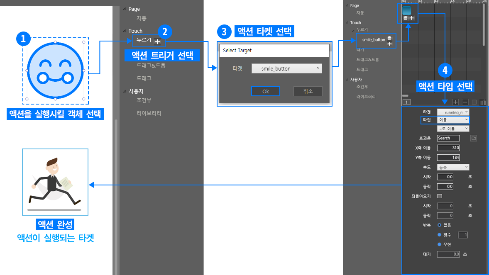

# 액션 적용 순서

## 액션 적용 순서

### ① 액션을 실행시킬 개체를 선택합니다. 

액션를 실행시킬 개체를 선택합니다. 작업창에 올라간 모든 레이어에 액션을 지정할 수 있습니다. 

### ② 액션 인스펙터에서 액션 트리거를 선택합니다. 

특정 액션이 실행되기 전에 액션이 실행되도록 하는 액션 조건\(트리거\)을 선택합니다. 예를 들어 ‘누르기’는 마우스를 눌렀을 때 액션이 실행되도록 하는 조건입니다. \(1\)의 객체를 선택 후, 원하는 트리거 조건을 선택하고 오른쪽에 있는 ‘+' 버튼을 선택합니다.

### ③ 액션이 실행되는 액션 타켓 

선택한 트리거에서 ‘+’ 버튼을 선택하면 액션이 실행할 액션 타켓 선택 팝업창이 나타납니다. 팝업창에서 타켓 드롭다운 메뉴에서 액션이 실행될 액션 타켓을 선택합니다. 작업창에 올라간 모든 레이어는 액션 타켓이 될 수 있습니다. 

### ④ 타임라인 뷰에 생성된 액션 선택 

타켓을 선택하고 나면 액션 인스펙터와 타임라인 뷰에 액션 목록이 나타납니다. 액션을 선택하면 액션 속성 창이 나타납니다. 

### ⑤ 액션 타입 설정 및 액션 완성 

액션 속성 창에서 액션 타입을 선택할 수 있습니다. 액션 타입별로 속성 설정 값이 다르며, 액션 세부 설정이 가능합니다. 또한, 액션 타켓 목록에서 작업창 개 이외의 사운드, 조건부 같은 액션을 타켓으로 재설정할 수 있습니다. 액션 타입과 속성값 설정이 끝나면 액션이 완성됩니다.

