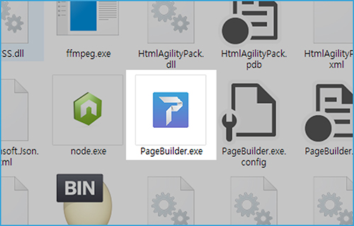
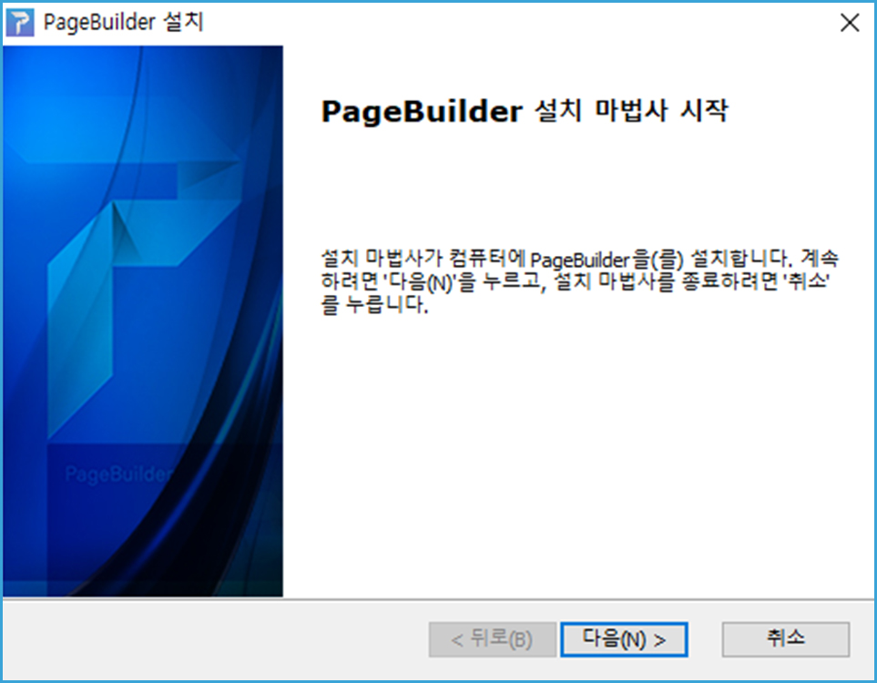
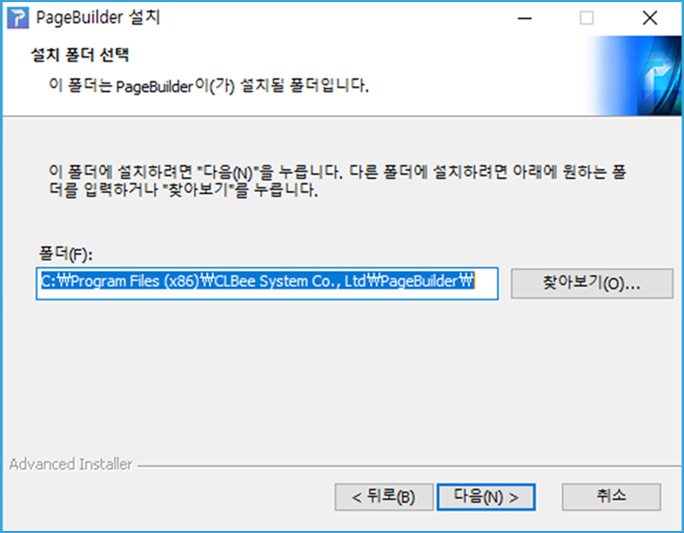
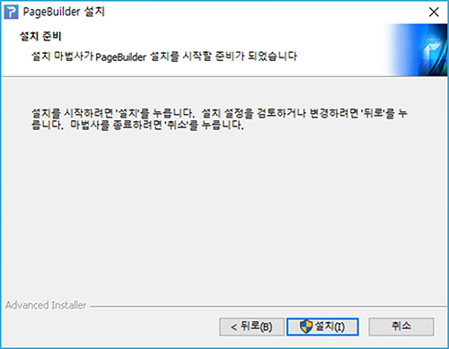
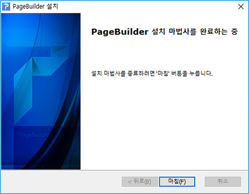
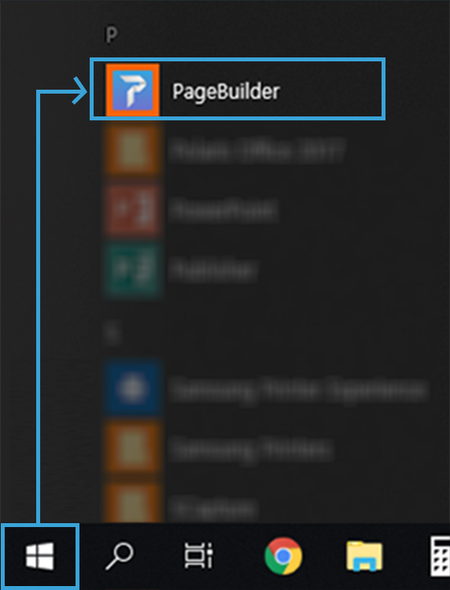
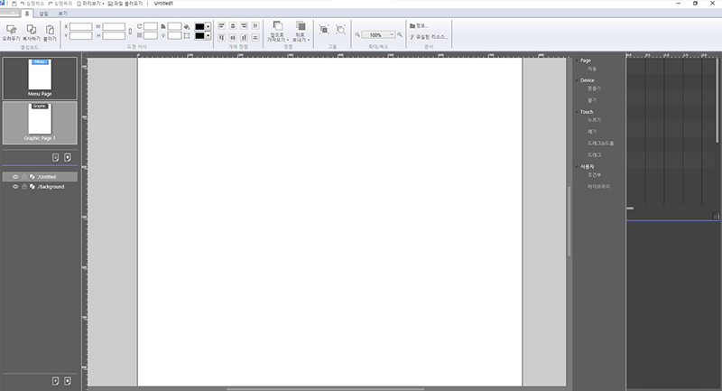

# **2. 페이지 빌더 설치하기**

> ## 페이지빌더 설치 환경

* Operating System: Window7 이상
* Memory: 최소4G, 권장 8G 이상
* Framework: Microsoft .Net Framework 4.6.1 이상
* Library: Microsoft Visual C++ 2013 Redistributable
----
 
## 페이지빌더 다운로드

1. Page Builder.exe 실행 파일을 더블클릭합니다. 

1. 설치 시작 화면에서 <button name="button">다음(N)></button>을 클릭합니다. 

3. 설치될 폴더를 지정한 후  <button name="button">다음(I)></button>을 클릭합니다. 

4. 다음 화면에서 <button name="button">설치(N)></button>을 클릭합니다. 

4. <button name="button">마침(F)></button>을 클릭합니다. 

---  

## 페이지빌더 실행

1. 시작 메뉴를 클릭하여 앞에서 설치한 페이지빌더 바로가기를 클릭해서 실행합니다. 
 

2. 프로그램이 실행되면서 페이지빌더 로딩 페이지가 나타납니다. 

 
3. 로딩페이지 이후에 페이지빌더가 실행됩니다. 

-------
   
