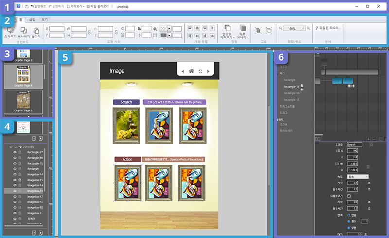
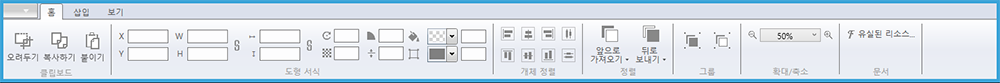
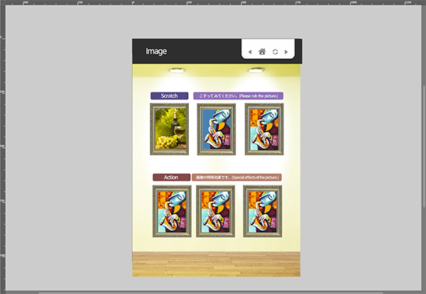
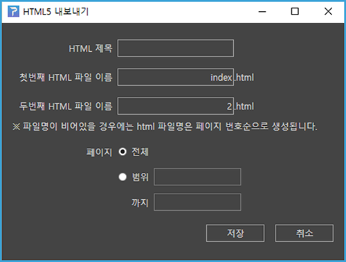
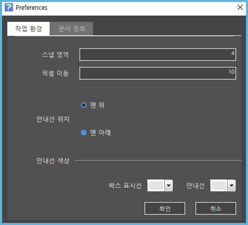

# **3. 작업 영역 살펴보기**
페이지빌더는 다음 화면과 같이 6개의 주요 작업 영역으로 구성됩니다. 
화면 구성이 직관적이고 간단하므로 초보 사용자도 쉽게 사용할 수 있습니다. 
숙련된 사용자는 고급 기능을 사용하여 더 빠른 편집을 할 수 있습니다.

----

## **작업 영역 및 패널**

 </img>

### **① 빠른 실행 도구 모음**

 </img>

빠른 실행 도구 모음은 화면 최상단에 위치합니다. 
빠른 실행 도구 모음에는 저장, 실행취소, 실행복귀, 미리보기, 파일 불러오기 같은 사용자가 자주 사용하는 도구가 있습니다. 

### **② 컨트롤 패널**

 </img>

컨트롤 패널은 화면 상단에 위치합니다. 컨트롤 패널에는 객체를 세부적으로 편집할 때 사용하는 기능들을 담고 있습니다. 예를 들어, 객체의 크기와 위치를 조절하는 기능과 색상을 변경하는 속성이 있습니다. 

### **③ 페이지 패널**

 </img>

페이지 패널에서는 페이지 윤곽이 보이는 썸네일 이미지의 목록을 볼 수 있습니다.
드래그로 페이지 순서를 재배치할 수 있으며, 페이지를 추가하거나 삭제할 수 있습니다. 

### **④ 레이어 패널**

레이어 패널에서는 레이어를 편리하게 구성하고 관리할 수 있습니다. 페이지별 레이어 목록 확인과 레이어 추가, 삭제를 할 수 있습니다. 또한, 앞의 눈 아이콘을 클릭하면 작업창에서 레이어를 숨기거나 보이게 할 수 있고, 앞의 자물쇠 아이콘을 누르시면 레이어 이동을 잠그거나 풀 수 있습니다.

> 레이어 패널에서 객체 잠금시에는 작업창 위의 객체는 선택되지 않아 움직일 수 없습니다.
하지만 레이어 패널에서의 잠금된 레이어는 선택이 가능하여 레이어의 순서 변경과 객체 순서를 바꿀 수 있습니다.

### **⑤ 작업창**

작업창은 화면 중앙에 위치하며 사용자가 편집하는 영역입니다. 작업 영역에 그려진 객체들은 최종 출력에서도 보입니다. 예를 들면 작업 영역 밖에서부터 작업 영역 안쪽으로 이동하는 객체 애니메이션은 이 영역에서만 보입니다. 그리드와 가이드라인을 적절하게 사용하면 편집에 도움을 받을 수 있습니다.

### **⑥ 액션 패널**

액션 패널은 객체에 동작 효과 또는 사용자 인터랙션을 줄 수 있는 작업 영역입니다.
적용된 효과를 객체별로 타임라인에서 볼 수 있습니다. 예를 들면 객체를 시간별로 이동하거나 회전하기, 깜박거리는 효과를 줄 수 있습니다.

왼쪽의 액션 컨트롤러에서 액션을 실행시키는 다양한 모드들이 있습니다. 모드 선택 후 옆의 플러스 버튼을 누르면 액션 타켓을 설정할 수 있습니다. 오른쪽 상단의 타임라인 상태표시에서는 시간의 흐름에 따른 액션이 표시됩니다. 액션을 편집하거나 적용 시간을 수정할 수 있습니다. 오른쪽 하단의 액션 속성 창에서 객체에 적용된 액션의 세부 속성값을 조절할 수 있습니다.

-----------

## **파일 메뉴 설명**

페이지 빌더의 유일한 메뉴는 파일 메뉴입니다. 파일 메뉴에는 새로만들기, 열기, 저장, 내보내기 등의 기능이 있습니다. 이 절에서는 파일 메뉴의 순서대로 기능을 설명합니다.

화면 상단의 파일 메뉴를 클릭하면 다음과 같은 메뉴 목록이 나타납니다.

### **① 새로만들기**

새로 만들기는 새로 작업을 시작합니다. 다음 대화상자에서 작업영역의 크기와 방향을 지정할 수 있습니다. 설정을 완료하면 [확인]을 클릭합니다.

### **② 열기**

저장된 페이지빌더 파일(확장자.pb)을 열 수 있습니다.

### **③ 최근 파일**

최근에 작업한 파일의 목록을 볼 수 있습니다.

### **④~⑤ 저장 / 다른 이름으로 저장**

작업한 내용을 파일로 저장합니다. 페이지 빌더는 내부에서 효과적인 작업을 위해
자체적인 파일 포맷을 사용합니다. 문서의 내용뿐만 아니라 문서 정보, 레이어와 같은
편집 정보를 저장합니다. 파일 확장자는 .pb입니다.

### **⑥ 패키지 파일로 저장**

저장 위치와 폴더 이름을 설정한 후 저장을 누르면 _pkg.pb와 작업에 사용한 모든 리소스가 [파일명]_Package 폴더에 저장됩니다. 동시에 zip 파일이 같이 생성됩니다. 

### **⑦ 가져오기**

가져오기 메뉴에서 pdf 파일을 불러올 수 있습니다. 가져온 페이지는 페이지빌더의
개별 페이지에 배치됩니다. (이미지 형태로 가져오므로 pdf 객체의 편집은 불가능합니다.)

> pdf 파일을 불러올 경우 작업하고 있는 페이지의 다음 페이지부터 불러온 pdf 파일의 이미지가 나타납니다.

### **⑧ 내보내기**

내보내기 기능에는 [썸네일 내보내기]와 [HTML5 내보내기]가 있습니다.

[썸네일 내보내기]를 사용하면 작업한 페이지가 png파일로 내보내집니다. 전체 페이지 혹은 부분 페이지를 내보낼 수 있습니다. 또한 내보낼 이미지의 크기를 조절할 수 있으며, 비율을 변경하면 이미지 크기에 영향을 줍니다. 

[HTML5 내보내기]에서는 작업한 문서가 [파일명] 폴더가 내보내집니다. 동시에 zip 파일도 생성됩니다.

> html 제목 부분에 작성한 내용은 내보내지는 html의 파일명이 아닌 웹 브라우저 (브라우저 탭)에 나타나는 페이지 타이틀 입니다.

내보낸 후 파일명/pb.html을 더블클릭하면 웹 브라우저에서 바로 실행할 수 있습니다.

### **⑨ 환경설정**

환경설정에서는 [작업 환경]과 [문서 정보] 탭이 있습니다. 
[작업 환경]탭 에서는 스냅 영역, 픽셀 이동, 안내선의 위치와 색상을 설정할 수 있습니다.

**[스냅 영역]** 은 컨트롤 패널의 [보기]-[안내선에 붙이기], [박스선에 붙이기] 사용시에 객체가 안내선 또는 도형에 붙는 거리를 수치로 조절할 수 있습니다.

**[픽셀 이동]** 은 Shift+방향기로 객체의 위치를 조정할 시에 한번에 얼만큼 이동할 수치를 조절할수 있습니다. 

**[안내선의 위치]** 로 필요시에 따라 안내선을 레이어 최상단이나 최하단에 위치하도록 설정할 수 있습니다.

**[안내선 색상]** 에선 박스 표시선과 안내선의 색상을 자유롭게 바꿀 수 있습니다.

**[작업환경 탭]** 에서는 스냅영역, 안내선 위치와 안내선 색상을 설정할 수 있습니다.

[문서 정보 탭]에서는 문서의 정보를 설정합니다. 파일명이 비어있을 경우 html 파일명은 페이지 번호순으로 생성됩니다.

### **⑩도움말**
도움말에는 [Pagebuilder에 대해]와 [(주)클비시스템]가 있습니다.

[Pagebuilder에 대해]에서는 페이지빌더의 버전 정보를 확인할 수 있습니다.

[(주)클비시스템]을 선택시엔 회사의 정보를 볼 수 있는 클비시스템의 홈페이지와 연결됩니다.

### **⑪나가기**
현재 작업 중인 문서를 닫고 페이지빌더를 종료합니다.

---
