# **컨트롤 패널 살펴보기**

* [홈 탭](llll_controlpanel.md#home-tap) 에서는 객체를 편집하는 도구들을 보여줍니다. 
* [삽입 탭](llll_controlpanel.md#insert-tap)에서는 텍스트 박스, 이미지 박스, 도형 등 다양한 도구들을 보여줍니다. 
* [보기 탭](llll_controlpanel.md#view-tap)에서는 작업에 도움이 되는 눈금자, 안내선을 보여줍니다.

## **홈 탭**

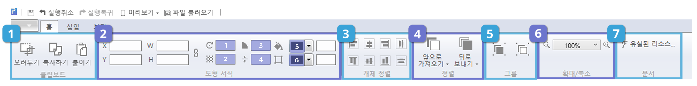

컨트롤 패널의 기본은 홈 탭 모드입니다. 홈 탭에는 [클립보드](llll_controlpanel.md#zmfflqqhem), [도형 서식](llll_controlpanel.md#ehgudtjtlr), [개체 정렬](llll_controlpanel.md#rocpwjdfuf), [정렬](llll_controlpanel.md#wjdfuf), [그룹](llll_controlpanel.md#rmfnq), [확대/축소](llll_controlpanel.md#ghkreocnrth), [유실된 리소스](llll_controlpanel.md#dbtlfehlsflthtm) 같은 객체를 편집하기 위한 편리 기능이 있습니다.

### **① 클립보드**

* 오려두기: 객체를 지웠다가 다시 붙이는 기능입니다.
* 복사하기: 객체를 복사하는 기능입니다.
* 붙이기: 복사한 것을 붙이는 기능입니다.

### **② 도형 서식**

* X, Y: 객체의 위치를 나타내며 임의로 지정할 수 있습니다. \(단위는 px\)
* W, H: 객체의 크기\(너비와 높이\)를 나타내며 임의로 지정할 수 있습니다. \(단위는 px\)
* 회전: 객체에 회전 값을 나타냅니다. \(단위는 radian\)
* 불투명도: 객체의 불투명도를 나타냅니다.
* 라운딩 크기: 사각형 가장자리의 둥근 정도를 나타냅니다.
* 선 두께: 선의 굵기를 나타냅니다. \(단위는 px\)
* 채움 색상: 객체 내부를 원하는 색상으로 채웁니다.
* 테두리 색상: 객체 테두리의 색상을 나타냅니다.

### **③ 객체 정렬**

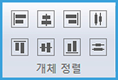

정렬은 여러 개의 레이어 모서리 위치를 맞추거나 간격을 적절하게 지정할 수 있는 도구입니다. 두 개 이상의 레이어를 선택한 후 원하는 방향의 정렬 및 배분 아이콘을 선택하시면 됩니다.

| 왼쪽 정렬 | 가운데\(수직\) 정렬 | 오른쪽 정렬 | 수직 중앙 정렬 |
| :---: | :---: | :---: | :---: |
| 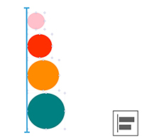 |  | 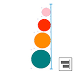 | 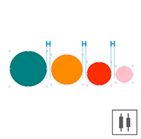 |

| 상단 정렬 | 가운데\(수평\) 정렬 | 하단 정렬 | 수평 중앙 정렬 |
| :---: | :---: | :---: | :---: |
| 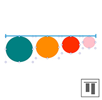 |  | 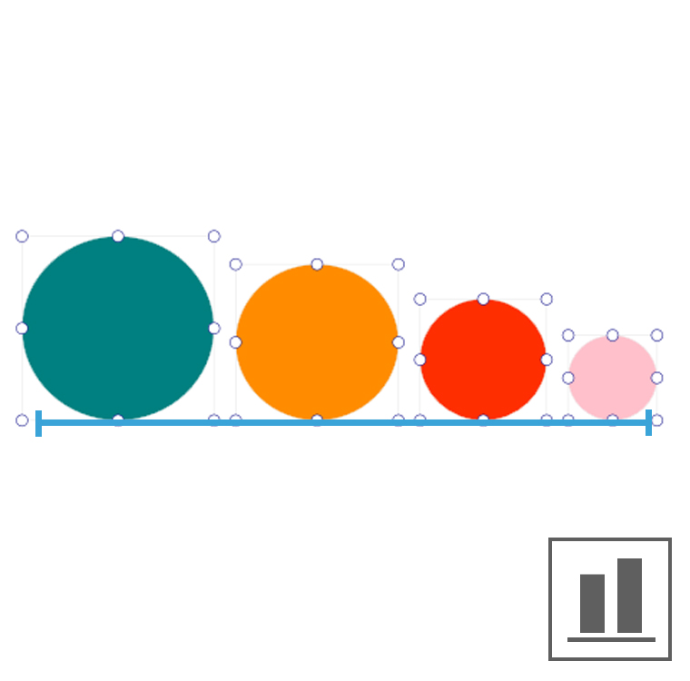 |  |

### **④ 정렬\(z-index\)**

객체를 선택한 후 정렬 아이콘을 선택하시면 객체의 배치 순서를 바꿀 수 있습니다.

| 현재 위치 \(2-3-1\) | 앞으로 가져오기 \(2-1-3\) | 맨 앞으로 가져오기 \(1-2-3\) |
| :---: | :---: | :---: |
|  |  | 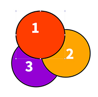 |

| 현재 위치 \(1-2-3\) | 뒤로 보내기 \(2-1-3\) | 맨 뒤로 보내기 \(2-3-1\) |
| :---: | :---: | :---: |
| 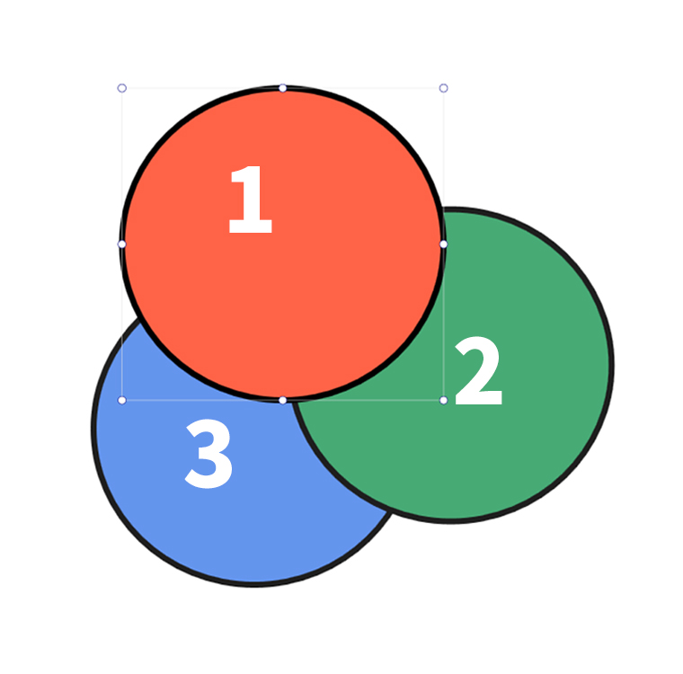 |  |  |

| 현재위치 | 앞으로 가져오기 | 맨앞으로 가져오기 |
| :---: | :---: | :---: |
|  |  |  |

객체의 정렬 순서\(z-index\)는 레이어 패널에서 확인할 수 있으며, 드래그앤드롭으로도 객체 순서를 바꿀 수 있습니다.

### **⑤ 그룹**

그룹은 둘 이상의 객체를 묶어 하나의 객체처럼 다루는 방법입니다.

| 그룹 지정 | 그룹 해제 |
| :---: | :---: |
| 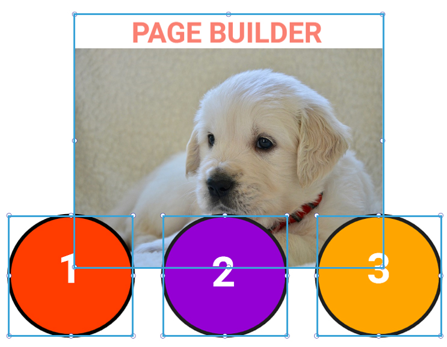 | 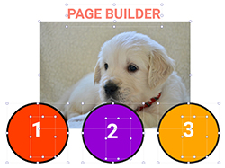 |

* 그룹 지정: 여러 개의 객체를 선택하고 그룹 아이콘을 클릭하면 그룹화됩니다.
* 그룹 해제: 그룹 해제 아이콘을 클릭하면 그룹이 해제됩니다.

| 그룹 지정 시 레이어 | 그룹 해제 시 레이어 |
| :---: | :---: |
| 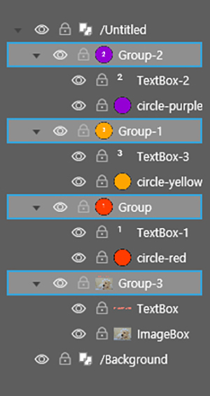 |  |

그룹화는 레이어 패널에서 확인할 수 있으며, 드래그앤드롭으로도 그룹 순서를 바꿀 수 있습니다.

### **⑥ 확대/축소**

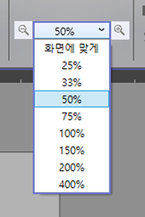

작업 창의 화면을 원하는 비율에 맞게 확대/축소 할 수 있습니다.

### **⑦ 유실된 리소스**

유실된 리소스란 페이지빌더 문서에서 참조하고 있으나 실제 존재하지 않는 리소스\(이미지 파일, 액션\)를 의미합니다.

1. 파일 대치: 유실된 파일을 다른 파일로 대치합니다.
2. 폴더 대치: 폴더 전체의 파일들을 같은 이름의 파일로 대치합니다.

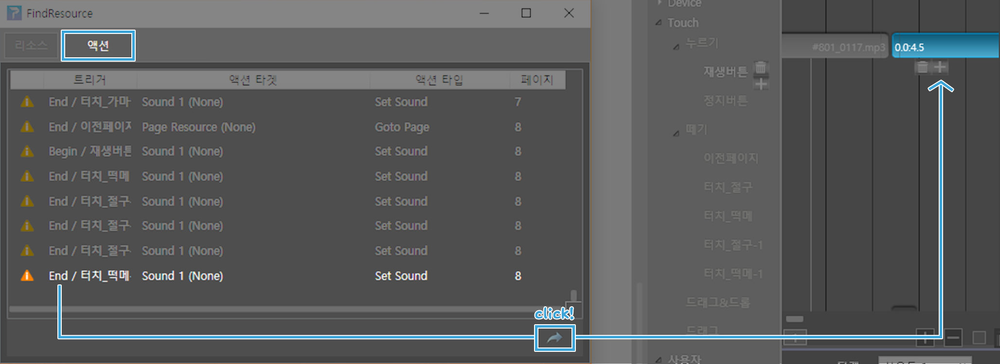

\[액션\] 항목에서 유실된 액션 효과를 선택하고 하단의 아이콘을 클릭하면 유실된 액션 경로를 찾을 수 있습니다.

## **삽입 탭**

상단 메뉴에서 삽입 탭을 선택하면 다음 그림과 같이 리본 메뉴가 삽입 탭 모드로 바뀝니다. [텍스트박스](llll_controlpanel.md#text-box), [이미지박스](llll_controlpanel.md#image-box), [스크롤](llll_controlpanel.md#scroll), [웹박스](llll_controlpanel.md#web-box), [무비박스](llll_controlpanel.md#movie-box), [테이블](llll_controlpanel.md#table)를 그릴 수 있습니다. 또한, 다양한 모양의 [도형](llll_controlpanel.md#figure)을 그릴 수 있습니다.

### **① 텍스트박스**

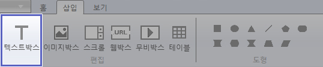

텍스트 박스는 글 상자입니다. 텍스트 박스를 선택하면 다음과 같은 텍스트 서식 메뉴가 나타납니다.

서식 메뉴에서 폰트의 종류, 폰트 크기 등의 글자 스타일과 들여쓰기, 행 간격 등 단락 스타일을 지정할 수 있습니다.

* \[입력허용\] 내보내기 시 사용자의 텍스트 입력 허용 여부를 설정할 수 있습니다.
* \[Auto Resizing\] 작성한 텍스트 높이에 맞춰 텍스트 박스 사이즈가 자동 조절 됩니다.

### **텍스트 입력하기**

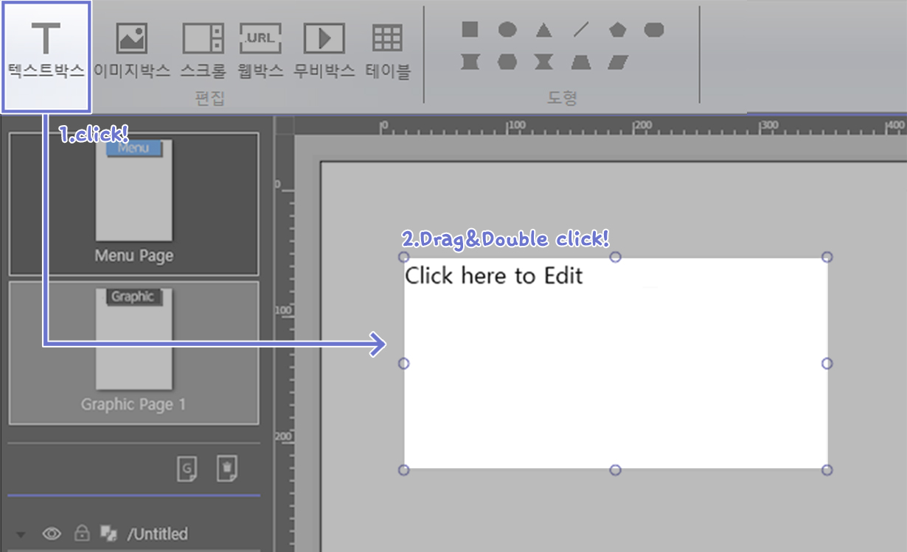

텍스트 박스 아이콘을 클릭하고 작업 창에 드래그하면 텍스트 박스가 생성됩니다. 텍스트 박스를 더블 클릭하면 텍스트를 입력할 수 있습니다.

### **② 이미지 박스**

이미지 박스는 이미지를 넣을 수 있는 박스입니다. 이미지 박스의 객체를 선택하면 이미지 박스의 서식 메뉴가 나타납니다.

서식 메뉴에서 이미지의 크기와 속성을 지정할 수 있습니다. 왼쪽의 옵션 영역의 파일 아이콘을 클릭하면 이미지 파일을 가져올 수 있습니다. 이미지 자르기\(크롭\)과 액션 효과를 적용할 수 있습니다. \(현재 지원하는 이미지 형식은 png, jpeg, jpe, gif, tiff, tif 입니다\)

### **이미지 넣기**

1. 이미지 박스를 클릭하고 작업창에 드래그를 하면 이미지 박스가 생성됩니다. 

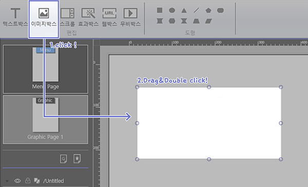

1. 이미지 박스 선택 후 이미지 박스 서식 메뉴에서 왼쪽에 있는 파일 아이콘을 선택하면

   이미지가 열립니다.

### **이미지 자르기**

이미지 박스 서식 메뉴에서 '크롭'을 선택한 후 이미지 포인터를 드래그하여 이미지 크기를 조절할 수 있습니다.

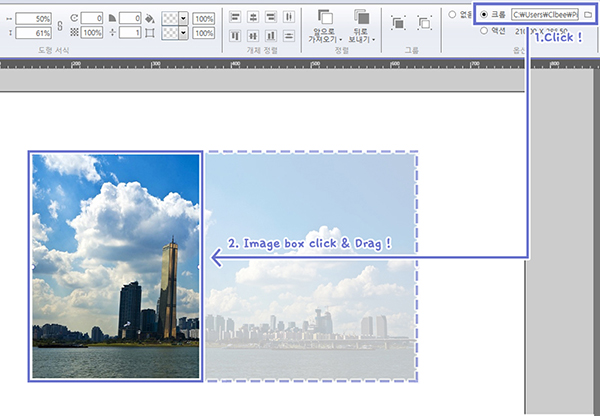

### **이미지에 액션 효과 적용하기**

이미지에 다양한 액션 효과를 적용할 수 있습니다.

* 푸쉬: 이미지를 클릭하면 다음 이미지가 보였다가 사라집니다. 
* 토글: 이미지를 클릭하면 다음 이미지가 나타납니다. 
* 깜빡거림: 첫번째 이미지와 두번째 이미지가 번갈아 나타납니다. 속도와 동작 시간을 조절할 수 있습니다.
* 스크래치1: 첫번째 이미지에서 마우스 드래그한 부분이 지워지면서 두번째 이미지가 나타납니다.
* 스크래치2: 이미지 위에 마우스로 드래그한 부분이 지워집니다. 
* 스크래치3: 마우스로 드래그한 부분에 선택한 색상이 나타납니다. 

| 푸쉬 | 토글 | 깜빡거림 |
| :---: | :---: | :---: |
|  |  |  |

| 스크래치 1 | 스크래치 2 | 스크래치 3 |
| :---: | :---: | :---: |
|  | 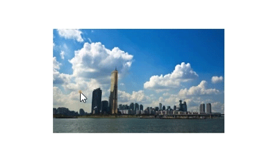 |  |

### **③ 스크롤**

스크롤 기능으로 화면의 스크롤 영역 크기를 조절할 수 있습니다.

스크롤 화면의 사이즈를 contents width\(가로\)와 contents height\(세로\)의 입력칸에 수치를 입력해서 조절 할 수 있습니다.

### **⑤ 웹 박스**

웹 박스를 사용해서 웹 사이트를 작업창에 가져올 수 있습니다.

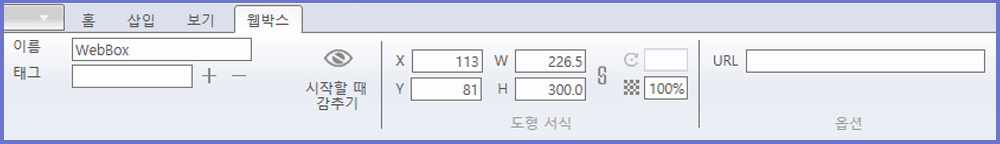

웹 박스 선택 후 웹 박스 서식 메뉴에서 URL 입력 박스에 웹 주소를 입력하면 됩니다.

### **URL 주소 넣기**

1. 웹 박스를 선택한 후 작업창에 드래그를 합니다.

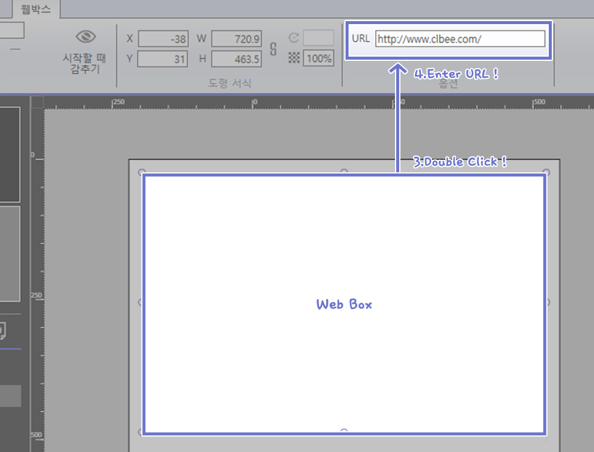

 2. 생성된 웹 박스를 더블 클릭 한 후 웹 박스 서식 메뉴에서 URL 입력 박스에 URL 주소를 입력합니다.

3. 미리보기 창에서 입력한 URL의 웹페이지를 볼 수 있습니다.

### **⑥ 무비 박스**

무비 박스 모드에서는 작업창에서 동영상 파일 재생을 할 수 있습니다.

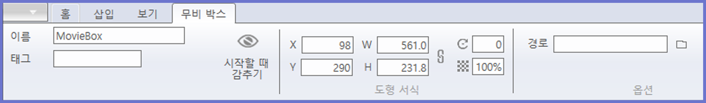

무비 박스 서식 메뉴에서 영상의 크기와 위치를 지정할 수 있습니다. 무비 박스 선택 후 경로의 파일 아이콘을 체크하면 영상 파일을 가져올 수 있습니다. \(현재 지원하는 비디오 형식은 mp4입니다.\)

### **영상 가져오기**

1. 무비 박스 선택 후 작업 창에 드래그합니다.

1. 객체를 더블 클릭한 후 무비 박스 서식 메뉴 맨 왼쪽에 있는 파일 아이콘을 클릭한 뒤 영상 파일을 선택하면 영상이 나타납니다.

1. 미리보기 창을 열면, 영상을 재생할 수 있습니다. 

> 영상 미리보기는 미리보기 하위 메뉴 중 'Google Chrome'과 'Internet Explorer' 에서만 확인이 가능합니다.  
>  \(작업창과 미리보기 하위 메뉴 중 '미리보기' 에서는 영상 재생이 불가합니다.\)

### **⑦ 테이블**

테이블을 이용하여 표를 만들 수 있습니다.

테이블 서식 메뉴에서 표의 크기와 위치를 지정할 수 있습니다. 테두리 더블 클릭하시면 포의 테두리 세부 설정이 가능합니다.

### **테이블 사용하기**

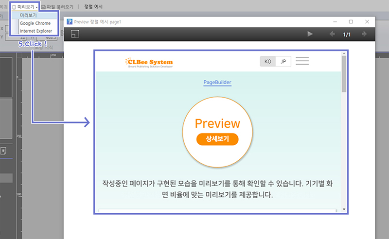

테이블 아이콘을 클릭하면 표의 칸수를 설정할 수 있는 칸이 나타납니다. 원하시는 만큼의 칸수를 마우스로 선택한 뒤 작업 창에 드래그하면 테이블이 만들어집니다.

### **⑧ 도형**

도형 메뉴에서 원하는 모양의 도형을 선택해서 그릴 수 있습니다.

서식 메뉴에서 도형의 크기, 위치, 회전, 투명도, 선 두께 등의 값을 조절할 수 있습니다. 또한, 정렬, 그룹화, 옵션을 지정할 수 있습니다.

옵션에서 푸시와 깜박거림 효과가 있습니다.

\[깜박거림\] 효과에서 정지할 때 멈추기를 하면 효과를 마우스 클릭으로 멈출 수 있습니다. 동작 시간과 깜박거리는 속도를 지정할 수 있습니다.

| 푸쉬 | 깜박거림 |
| :---: | :---: |
|  |  |

* 푸쉬: 버튼 다운하는 동안 선택한 도형이 반투명해집니다. 
* 깜박거림: 도형이 깜빡거리는 동작 시간과 속도를 지정할 수 있습니다.

## **보기 탭**

컨트롤 패널의 보기 모드는 눈금자 숨기기, 안내선 보기, 박스선에 붙이기, 안내선에 붙이기를 지원합니다.

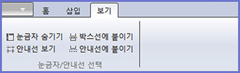

원하는 기능을 클릭하시면 사용이 가능합니다.

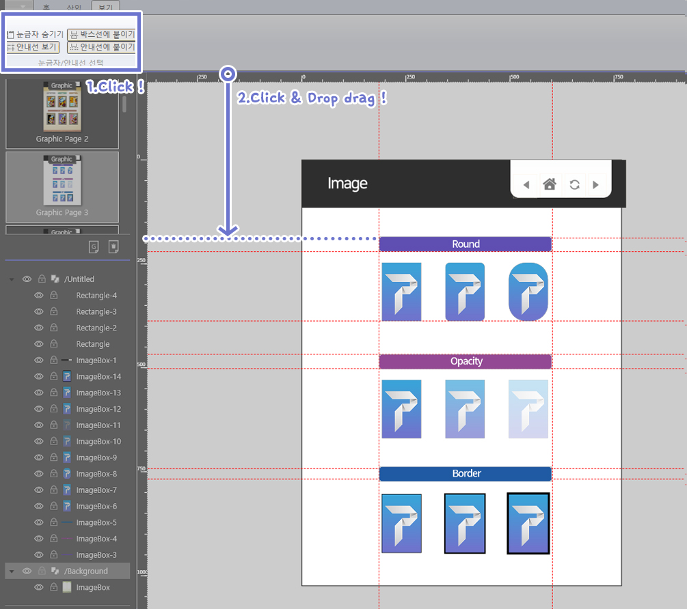

기능을 사용하시면 편집을 더욱더 쉽고 빠르게 하실 수 있습니다.

