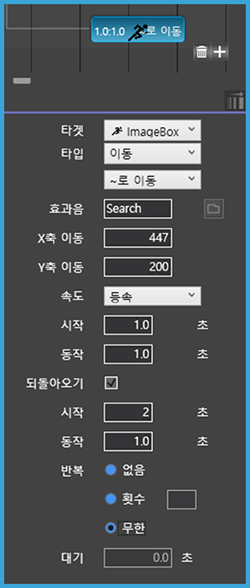

# 5. 액션 패널 살펴보기
~~~
액션은 페이지빌더의 핵심 기능 중에 하나로서 그래픽 애니메이션과 사용자와의 인터랙션을 처리합니다. 
액션 패널에서는 시간의 흐름에 따른 액션을 지정할 수 있습니다. 
객체에 적용할 수 있는 다양한 애니메이션 효과와 자동실행, 누르기(mouse down), 떼기(mouse up)와 같은 다양한 액션 기능을 제공합니다. 
~~~
-----
***설명으로 바로가기***
+ [액션 패널 기본 정보](#action-panel)
  + [액션 컨트롤러](#controller)
  + [타임라인 상태표시](#timeline)
  + [액션 속성 창](#setting)
+ [액션 지정 순서](#action-select)
+ [액션 타켓 살펴보기](#action-target)
  + 사운드
  + 링크
  + [페이지](#page)
+ [액션 타입 살펴보기 -1. 움직임 효과](#action-effect)
  + [모든 액션 멈춤](#ahemsdortusajacna)
  + [보기/감추기](#qhrlrkacnrl)
  + [이동](#dlehd)
  + [확대이동](#ghkreodlehd)
  + [회전](#ghlwjs)
  + [뒤집기](#enlwlqrl)
  + [애니메이션](#doslapdltus)
+ [액션 타입 살펴보기 -2. 정지 효과](#action-stop)
  + [액션 타입 살펴보기 -3. 태그값](#tag)
---

## **액션 패널 기본 정보**

액션 패널은 액션 컨트롤러, 타임라인 상태표시, 액션 속성 창으로 구성됩니다.  

### **① 액션 컨트롤러**

액션 컨트롤러에는 Page, Touch, 사용자와 같은 특정한 동작에 필요한 액션을 표시됩니다.

> 모드별 액션 설명

|모드|액션|
|----------|-----------------|
|Page|<li>**자동**: 페이지 실행시 자동으로 실행됩니다.</li><li>`'사운드' 액션의 경우 특정 브라우저에 따라 사용자 동작(클릭, 탭 등)후에 재생이 가능합니다.`</li>|
|Touch|<li>**누르기**: 객체 클릭 상태에서 액션이 실행됩니다.</li> <li>**떼기**: 객체에서 버튼 업 상태에서 액션이 실행됩니다. </li> <li>**드래그&드롭**: 객체를 다른 곳으로 끌어다 놓을 때 액션이 실행됩니다. </li> <li>**드래그**: 객체를 드래그 할 때 액션이 실행됩니다.</li><li>`드래그&드롭시 드래그 영역과 액션 영역 설정이 가능합니다.(표 하단에 부가설명 이미지가 있습니다.)`</li>|
|사용자&nbsp;|<li>**조건부**: 타겟과 속성을 비교한 설정값을 저장합니다. </li> <li>**라이브러리**: 라이브러리에 설정한 액션을 저장합니다. </li>|
 

`드래그&드롭시 드래그를 할 수 있는 범위인 드래그 영역과 드롭 효과가 나타나는 부분인
액션 영역을 지정할 수 있습니다.`

드래그&드롭 효과를 넣을 객체를 선택하고 사용자 모드 패널 위에 나타나는 i 아이콘을 누르시면 작업창에 파란색, 보라색 박스가 나타납니다. 파란색 선은 드래그 영역이며, 보라색 박스는 드랍시 액션 효과가 나타나는 영역입니다. 마우스로 영역을 설정한 뒤 설정 팝업창에서 확인 버튼을 누르시면 됩니다.

### **② 타임라인 상태표시**

타임라인에서는 시간의 흐름에 따라 액션을 표시합니다. 타임라인 작업 창에서 액션을 편집하거나, 액션 적용 시간을 수정할 수 있습니다. 

1. 시퀀스: 한 작업물에 액션 값을 설정한 여러 개의 액션 작업창을 만들 수 있습니다.
2. 시퀀스 추가: 시퀀스를 추가합니다.
3. 시퀀스 삭제: 시퀀스를 삭제합니다. 
4. 랜덤 재생: 체크하면 시작 시에 시퀀스가 랜덤으로 보여집니다.
5. 타임라인 뷰 확대/ 축소: 슬라이더를 사용하여 타임라인에 보이는 시간 축의 너비를 조정할 수 있습니다.

### **③ 액션 속성 창**

객체에 적용된 액션 타입에 따라 세부 속성값이 나타납니다. 속성값을 변경하여 액션을 다양하게 나타낼 수 있습니다.

- 타겟 : 액션의 타켓을 정합니다.
- 타입 : 타켓의 액션을 정합니다. 드롭다운 메뉴를 선택하면 다양한 타입의 종류가 나타납니다. 
- 효과음: 액션이 실행될 때 지정한 효과음(.mp3 파일)의 소리가 납니다.

___

## **액션 지정 순서**
액션을 지정하려면 먼저 액션을 나타낼 객체를 선택하고 액션 타입을 선택하면 됩니다. 
액션 효과는 객체(또는 그룹화된 객체)에 자동으로 또는 사용자의 반응에 따라 움직임을 줄 수 있습니다. 

___

## **액션 타켓 살펴보기**

  

효과를 적용할 액션의 타켓을 정합니다.

- 객체: 작업창 위에 올라가 있는 객체를 액션의 타켓으로 정합니다.
- 조건부: 설정값이 맞는 경우에만 저장한 액션을 실행합니다. 
- 라이브러리: 라이브러리에 추가한 액션을 실행합니다.
- 사운드 1,2: 음성 파일(.mp3 파일)이 실행이 됩니다.
- 링크: url를 입력해서 선택시에 새 창에서 열기 또는 다운로드가 가능합니다. 
- [페이지](#page): 페이지 전체가 타켓이 되어 페이지가 이동합니다.

### **[페이지]**
  
   
   
   #### **[페이지]** 은 지정한 페이지의 위치로 이동합니다. 
  
  - 다음 페이지: 다음 페이지로 이동합니다.
  - 이전 페이지: 이전 페이지로 이동합니다.
  - 보던 페이지: 현재 페이지가 나타납니다.
  - 홈: 메뉴 페이지로 이동합니다.
  - 입력: 입력한 번호의 페이지로 이동합니다.

____
  
## **액션 타입 살펴보기 - 1. 움직임 효과**
   

액션 타입에서 다양한 움직임 효과를 선택할 수 있습니다.

 

### **[모든 액션 멈춤]**

   

   #### **[모든 액션 멈춤]** 은 모든 액션의 동작을 멈춥니다. 

- 효과음: 동작 정지 시 지정한 효과음(.mp3 파일)의 소리가 납니다.
- 시작: 액션이 시작되는 시간을 지정합니다.

### **[보기/감추기]**

  
   
  
  
  #### **[보기/감추기]** 는 객체를 화면에서 보이거나 숨깁니다.
  - 효과음: 동작 정지 시 지정한 효과음(.mp3 파일)의 소리가 납니다.
  - 시작: 액션이 시작되는 시간을 지정합니다.

### **[페이드]**
 
   
    
   

   #### **[페이드]** 은 객체의 불투명도를 조절합니다.

  - 페이드 100%: 선택한 타켓이 완전히 다 보입니다.
  - 페이드 0%: 선택한 타켓이 완전히 안보입니다. 
  - 페이드 입력: 0%~100% 사이의 값을 입력해서 불투명도를 조절합니다.
  - 효과음: 동작 정지 시 지정한 효과음(.mp3 파일)의 소리가 납니다.
  - 속도: 액션 속도를 선택합니다. (등속/가속/감속/가속 후 감속)
  - 동작: 액션의 동작 지속 시간을 지정할 수 있습니다. 
  - 되돌아오기: 체크하면 효과를 반대로 실행해 원래 상태로 돌아옵니다. 
  - 반복: 동작의 반복 횟수를 지정합니다. (없음/횟수/무한)
  - 대기: 반복 실행 시 액션 재시작 전 대기 시간을 정할 수 있습니다.
  
### **[이동]**

   
    
   

#### **[이동]** 은 객체를 원하는 곳으로 이동시킵니다.

  - '~로 이동/~만큼 이동/곡선 이동': 이동 방법을 선택합니다.
  - 효과음: 동작 정지 시 지정한 효과음(.mp3 파일)의 소리가 납니다.
  - x축 이동, y축 이동: 입력한 만큼 x축과 y축으로 이동합니다. (객체를 마우스로 움직여 이동시킬 위치를 정하셔도 됩니다.) 
  - 속도: 액션의 속도를 조절합니다. (등속/가속/감속/가속 후 감속)
  - 시작: 액션의 시작 시간을 지정합니다.
  - 동작: 액션의 동작 지속 시간을 지정합니다. (반드시 지정해야 액션이 움직입니다.) 
  - 되돌아오기: 체크하면 효과를 반대로 실행해 원래 상태로 돌아옵니다. 
  - 반복: 동작의 반복 횟수를 지정합니다. (없음/횟수/무한)
  - 대기: 반복 실행 시 액션 재시작 전 대기 시간을 정할 수 있습니다.

### **[확대이동]**

   
    
   

   #### **[확대이동]** 은 객체의 크기를 조절하고 이동합니다.

  - 효과음: 동작 정지 시 지정한 효과음(.mp3 파일)의 소리가 납니다.
  - '좌표 X, Y': 객체를 이동시킬 X와 Y축 위치를 지정할 수 있습니다. (객체를 마우스로 움직여 이동시킬 위치를 정하셔도 됩니다.)
  - '크기 W, H': 객체의 크기를 지정할 수 있습니다. (객체를 마우스로 확대/축소시켜 변형할 객체의 모습을 정할 수 있습니다.)
  - 속도: 액션의 속도를 조절합니다. (등속/가속/감속/가속 후 감속)
  - 시작: 액션의 시작 시간을 지정합니다.
  - 동작: 액션의 동작 지속 시간을 지정할 수 있습니다. 
  - 되돌아오기: 체크하면 효과를 반대로 실행해 원래 상태로 돌아옵니다. 
  - 반복: 동작의 반복 횟수를 지정합니다. (없음/횟수/무한)
  - 대기: 반복 실행 시 액션 재시작 전 대기 시간을 정할 수 있습니다.

### **[회전]**

   
    
   

   #### **[회전]** 은 객체를 회전시킵니다.

  - '~로 회전, ~만큼 회전': 객체의 회전 방법을 선택합니다.
  - 효과음: 동작 정지 시 지정한 효과음(.mp3 파일)의 소리가 납니다.
  - 기준점 X, Y: 회전의 기준점이 되는 좌표를 정합니다.
  - 회전수: 360도로 회전할 횟수를 정합니다.
  - 시계반대방향: 시계 반대 방향으로 회전합니다
  - 속도: 액션의 속도를 조절합니다. (등속/가속/감속/가속 후 감속)
  - 동작: 액션의 동작 지속 시간을 지정할 수 있습니다. 
  - 되돌아오기: 체크하면 효과를 반대로 실행해 원래 상태로 돌아옵니다. 
  - 반복: 동작의 반복 횟수를 지정합니다. (없음/횟수/무한)
  - 대기: 반복 실행 시 액션 재시작 전 대기 시간을 정할 수 있습니다.

### **[뒤집기]**

   
    
   

   #### **[뒤집기]** 는 객체를 가로, 세로 방향으로 뒤집습니다.

  - '가로 뒤집기/세로 뒤집기': 타켓이 뒤집히는 방향을 정합니다.
  - 효과음: 동작 정지 시 지정한 효과음(.mp3 파일)의 소리가 납니다.
  - 속도: 액션의 속도를 조절합니다. (등속/가속/감속/가속 후 감속)
  - 시작: 액션의 시작 시간을 지정합니다.
  - 동작: 액션의 동작 지속 시간을 지정할 수 있습니다. 
  - 되돌아오기: 체크하면 효과를 반대로 실행해 원래 상태로 돌아옵니다. 
  - 반복: 동작의 반복 횟수를 지정합니다. (없음/횟수/무한)
  - 대기: 반복 실행 시 액션 재시작 전 대기 시간을 정할 수 있습니다.

### **[애니메이션]**

   
    
   

   #### **[애니메이션]** 은 여러장의 이미지가 순서대로 바뀌면서 보여집니다. `('누르기 모드'에서는 실행되지 않습니다.)`

  - 효과음: 동작 정지 시 지정한 효과음(.mp3 파일)의 소리가 납니다.
  - 이미지: 순서대로 보여질 적용할 이미지를 추가하거나 삭제합니다.
  - 되돌아오기: 체크하면 효과를 반대로 실행해 원래 상태로 돌아옵니다. 
  - 초기값 복원: 애니메이션이 끝나면 처음 이미지가 나타납니다.
  - 시작: 애니메이션의 시작 시간을 지정할 수 있습니다. 
  - 동작: 애니메이션 동작 지속 시간을 지정할 수 있습니다. 
  - 반복: 동작의 반복 횟수를 지정합니다. (없음/횟수/무한)

____

## **액션 타입 살펴보기 -2. 액션 정지**

액션을 정지하거나, 콘텐츠를 바꿀 수 있습니다.

 

 - 일시 정지: 지정한 타켓의 액션을 잠깐 멈춥니다.
 - 정지: 지정한 타켓의 액션을 멈춥니다.
 - 콘텐츠 지정: 객체의 콘텐츠를 바꿀 수 있습니다.
  
  ___

 ## **액션 타입 살펴보기 -3. 태그값**

 

 액션의 태그 값에 따라 다양한 속성을 넣을 수 있습니다.

 - 추가: 태그에 값을 추가합니다. ("He"+"llow"="Hellow", 30+40=3040)
 - 제거: 태그에 값을 제거합니다.
 - 교체: 태그 값을 바꿉니다.
 - 모두 제거: 태그 값을 모두 삭제합니다.
  - 더하기: 태그에 값을 더합니다. ("He"+"llow"="Hellow", 30+40=70)
  - 빼기: 태그에 값을 뺍니다. 
  - 곱하기: 태그에 값을 곱합니다.
  - 나누기: 태그에 값을 나눕니다. 
  ---
