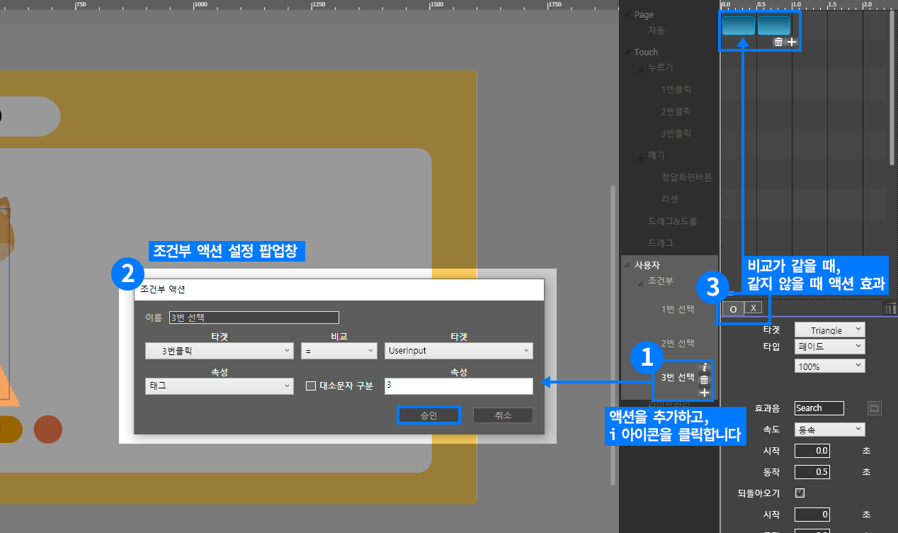
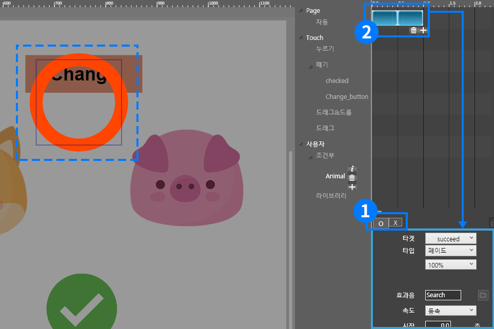

# 조건부 액션 영역 소개

## 조건부 액션 영역

액션 인스펙터에서 사용자 - 조건부를 클릭하면 오른쪽 + 플러스 아이콘이 나타납니다. 이콘을 누르면 조건부 액션 설정 팝업창이 나타납니다. 설정 후 타임라인과 속성창에서 액션 조건과 액션 타입을 선택하면 됩니다.

## 조건부 액션 영역 세부 소개 

### ① 액션 인스펙터에서 조건부

액션 인스펙터에서 사용자 &gt; 조건부를 선하면 옆에 + 플러스 아이콘이 나타납니다. 플러스 아이콘을 누르면 조건부 액션 설정 팝업창이 나타납니다. 


이미 추가한 조건부 액션의 경우 i 아이콘을 누르면 설정 팝업창이 다시 나타납니다.


### ② 조건부 액션 팝업창

먼저, 조건부 액션 팝업창에서 조건부 액션 이름을 만들고, 속성값을 비교할 두 개의 타겟을 선택합니다. 타켓 선택 후 속성을 비교할 등식을 선택합니다. 둘 중 한 개의 타켓은 user input으로 선택해서 사용자가 만든 태그값과 비교 할 수 있습니다.

<table>
  <thead>
    <tr>
      <th style="text-align:left">&#xBE44;&#xAD50; &#xB4F1;&#xC2DD;</th>
      <th style="text-align:left">&#xC124;&#xBA85;</th>
    </tr>
  </thead>
  <tbody>
    <tr>
      <td style="text-align:left">=</td>
      <td style="text-align:left">&#xB450; &#xAC1C;&#xC758; &#xD0C0;&#xCF13;&#xC758; &#xC18D;&#xC131;&#xAC12;&#xC774;&#xAC00;
        &#xAC19;&#xC744;&#xB54C; O (true) &#xC561;&#xC158;&#xC744; &#xC2E4;&#xD589;&#xD55C;&#xB2E4;.</td>
    </tr>
    <tr>
      <td style="text-align:left">&#x2260;</td>
      <td style="text-align:left">&#xB450; &#xAC1C;&#xC758; &#xD0C0;&#xCF13;&#xC758; &#xC18D;&#xC131;&#xAC12;&#xC774;
        &#xAC19;&#xC9C0; &#xC54A;&#xC744;&#xB54C; O (true) &#xC561;&#xC158;&#xC744;
        &#xC2E4;&#xD589;&#xD55C;&#xB2E4;.</td>
    </tr>
    <tr>
      <td style="text-align:left">&#xD3EC;&#xD568;</td>
      <td style="text-align:left">&#xD604;&#xC7AC; &#xD0C0;&#xCF13;&#xC758; &#xD0DC;&#xADF8;&#xC5D0; &#xBE44;&#xAD50;&#xD560;
        &#xD0C0;&#xCF13;&#xC758; &#xD0DC;&#xADF8;&#xAC00; &#xD3EC;&#xD568;&#xB418;&#xB294;
        &#xACBD;&#xC6B0; O (true) &#xC561;&#xC158;&#xC744; &#xC2E4;&#xD589;&#xD55C;&#xB2E4;.</td>
    </tr>
    <tr>
      <td style="text-align:left">&#xC804;&#xCCB4; &#xD3EC;&#xD568;</td>
      <td style="text-align:left">
        
&#xD604;&#xC7AC; &#xD0C0;&#xCF13;&#xC774; &#xAC00;&#xC9C4; &#xC804;&#xCCB4;
          &#xD0DC;&#xADF8;&#xC640; &#xBE44;&#xAD50;&#xD560; &#xD0C0;&#xCF13;&#xC758;
          &#xD0DC;&#xADF8;&#xAC00; &#xBAA8;&#xB450; &#xD3EC;&#xD568;&#xB418;&#xB294;
          &#xACBD;&#xC6B0;&#xC5D0;&#xB9CC;

        
O (true) &#xC561;&#xC158;&#xC744; &#xC2E4;&#xD589;&#xD55C;&#xB2E4;.

      </td>
    </tr>
  </tbody>
</table>### ③ 조건부 타임라인

조건부 타임라인에서 조건부 O \(true\)/ X \(false\) 상태별 나타나는 액션을 따로 만들 수 있습니다.

\(1\) 비교하는 타켓들의 속성값이 같을 때 , 같지 않을 때 중 하나를 선택합니다.

\(2\) 액션 속성값에서 액션 실행시 나타낼 액션 타입을 선택합니다.

**ex\) 비교가 같을 때 - 동그라미 도형 보기 액션 / 비교가 같지 않을 때 - 세모 도형 보기 액션**


조건부 실행 액션에 액션 타켓을 조건부로 설정해놓으면 \(조건부 안에 조건부\) 더 심화된 액션을 만들 수 있습니다.


